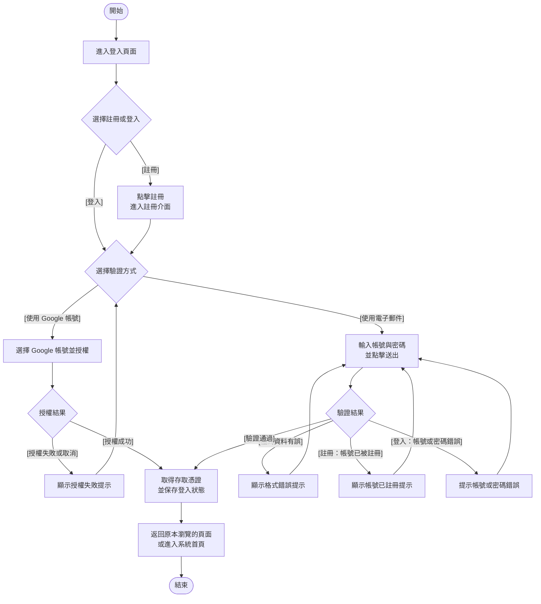
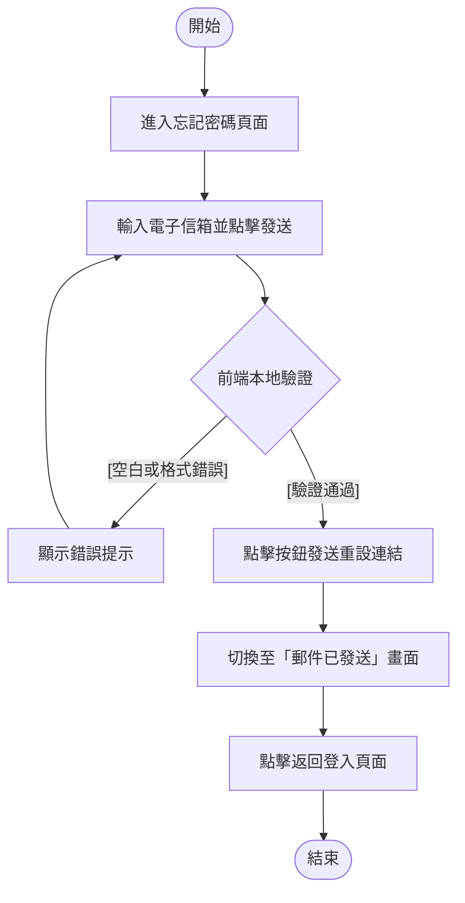
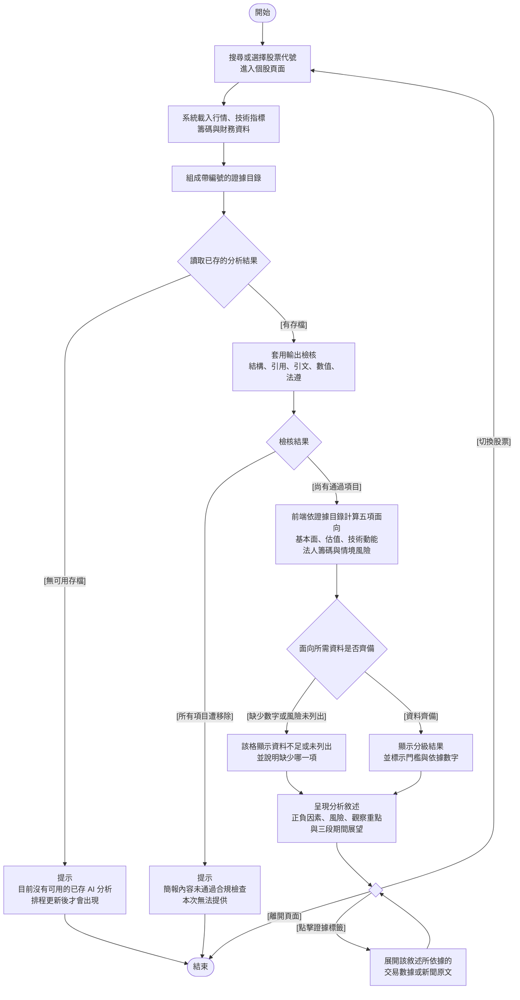
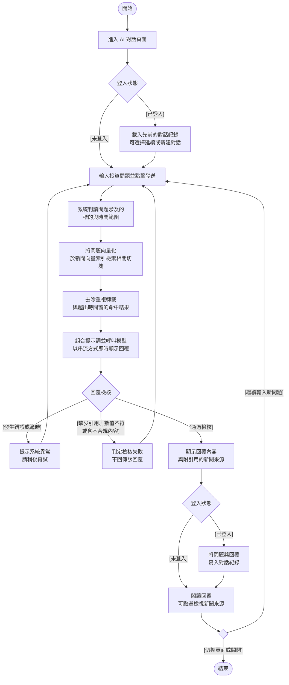
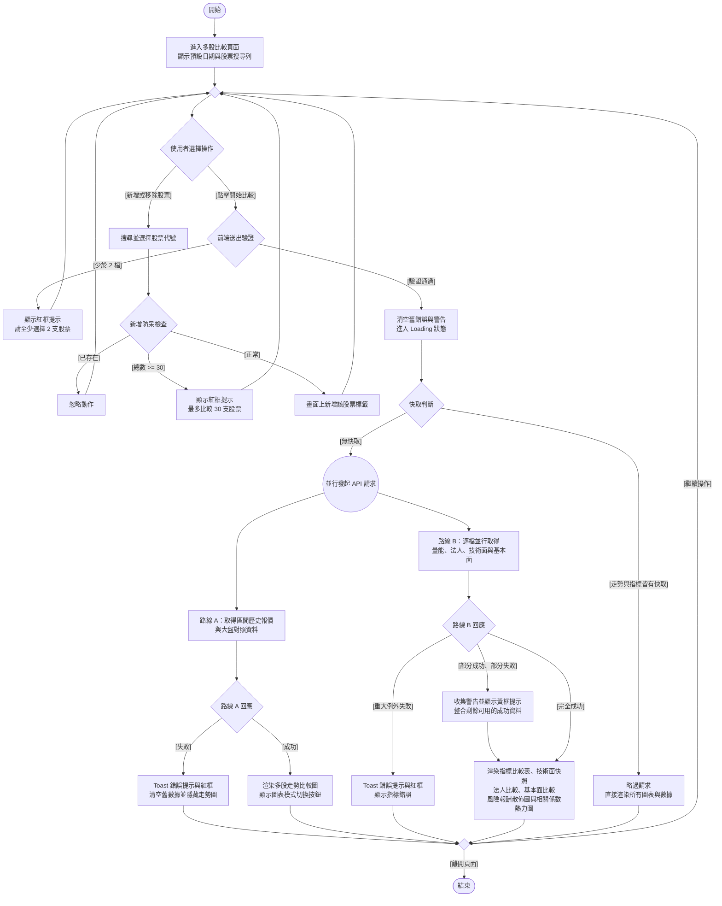
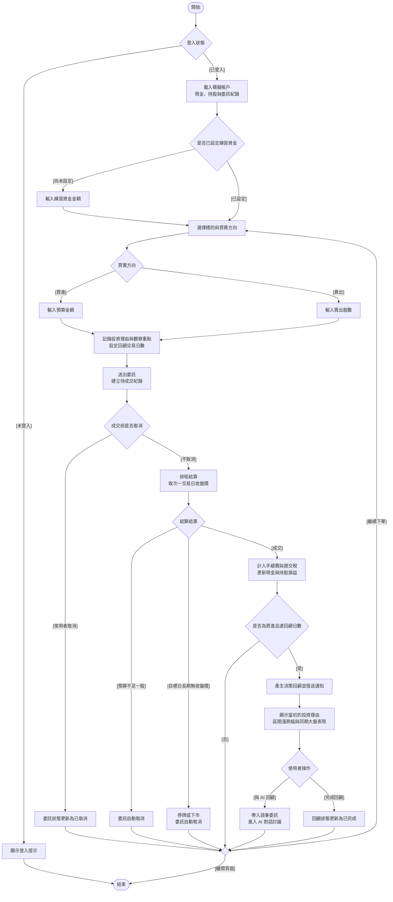

#會員註冊與登入

```mermaid
flowchart TD
    Start([開始]) --> Entry[進入登入頁面]
    Entry --> CondMode{選擇註冊或登入}

    CondMode -- "[註冊]" --> Reg0[點擊註冊\n進入註冊介面]
    CondMode -- "[登入]" --> CondWay
    Reg0 --> CondWay{選擇驗證方式}

    %% Google 路線：註冊與登入共用
    CondWay -- "[使用 Google 帳號]" --> G1[選擇 Google 帳號並授權]
    G1 --> CondG{授權結果}
    CondG -- "[授權失敗或取消]" --> ErrG[顯示授權失敗提示]
    ErrG --> CondWay
    CondG -- "[授權成功]" --> Token

    %% 電子郵件路線
    CondWay -- "[使用電子郵件]" --> Form[輸入帳號與密碼\n並點擊送出]
    Form --> CondForm{驗證結果}

    CondForm -- "[格式資料有誤]" --> ErrFmt[顯示格式錯誤提示]
    ErrFmt --> Form

    CondForm -- "[註冊：帳號已被註冊]" --> ErrDup[顯示帳號已註冊提示]
    ErrDup --> Form

    CondForm -- "[登入：帳號或密碼錯誤]" --> ErrAuth[提示帳號或密碼錯誤]
    ErrAuth --> Form

    CondForm -- "[驗證通過]" --> Token[取得存取憑證\n並保存登入狀態]

    Token --> Home[返回原本瀏覽的頁面\n或進入系統首頁]
    Home --> Finish([結束])
```

#忘記密碼

```mermaid
flowchart TD
    Start([開始]) --> Step1[進入忘記密碼頁面]
    Step1 --> Step2[輸入電子信箱並點擊發送]

    Step2 --> Cond1{前端本地驗證}

    Cond1 -- "[空白或格式錯誤]" --> Error1[顯示錯誤提示]
    Error1 --> Step2

    Cond1 -- "[驗證通過]" --> Step3[點擊按鈕發送重設連結]

    Step3 --> Step4[切換至「郵件已發送」畫面]

    Step4 --> Step5[點擊返回登入頁面]
    Step5 --> Finish([結束])
```

#個股分析與證據溯源

```mermaid
flowchart TD
    Start([開始]) --> Step1[搜尋或選擇股票代號\n進入個股頁面]
    Step1 --> Step2[系統載入行情、技術指標\n籌碼與財務資料]
    Step2 --> Step3[組成帶編號的證據目錄]

    Step3 --> Cond1{讀取已存的分析結果}

    Cond1 -- "[無可用存檔]" --> Error1[提示\n目前沒有可用的已存 AI 分析\n排程更新後才會出現]
    Error1 --> Finish([結束])

    Cond1 -- "[有存檔]" --> Step4[套用輸出檢核\n結構、引用、引文、數值、法遵]

    Step4 --> Cond2{檢核結果}

    Cond2 -- "[所有項目遭移除]" --> Error2[提示\n簡報內容未通過合規檢查\n本次無法提供]
    Error2 --> Finish

    Cond2 -- "[尚有通過項目]" --> Step5[前端依證據目錄計算五項面向\n基本面、估值、技術動能\n法人籌碼與情境風險]

    Step5 --> Cond3{面向所需資料是否齊備}

    Cond3 -- "[缺少數字或風險未列出]" --> Step6[該格顯示資料不足或未列出\n並說明缺少哪一項]
    Cond3 -- "[資料齊備]" --> Step7[顯示分級結果\n並標示門檻與依據數字]

    Step6 --> Step8[呈現分析敘述\n正負因素、風險、觀察重點\n與三段期間展望]
    Step7 --> Step8

    Step8 --> Cond4{ }

    Cond4 -- "[點擊證據標籤]" --> Step9[展開該敘述所依據的\n交易數據或新聞原文]
    Step9 --> Cond4

    Cond4 -- "[切換股票]" --> Step1
    Cond4 -- "[離開頁面]" --> Finish
```

#AI對話

```mermaid
flowchart TD
    Start([開始]) --> Step1[進入 AI 對話頁面]

    Step1 --> Cond0{登入狀態}
    Cond0 -- "[已登入]" --> Step2[載入先前的對話紀錄\n可選擇延續或新建對話]
    Cond0 -- "[未登入]" --> Step3
    Step2 --> Step3[輸入投資問題並點擊發送]

    Step3 --> Step4[系統判讀問題涉及的\n標的與時間範圍]
    Step4 --> Step5[將問題向量化\n於新聞向量索引檢索相關切塊]
    Step5 --> Step6[去除重複轉載\n與超出時間窗的命中結果]
    Step6 --> Step7[組合提示詞並呼叫模型\n以串流方式即時顯示回覆]

    Step7 --> Cond1{回覆檢核}

    Cond1 -- "[發生錯誤或逾時]" --> Error1[提示系統異常\n請稍後再試]
    Error1 --> Step3

    Cond1 -- "[缺少引用、數值不符\n或含不合規內容]" --> Error2[判定檢核失敗\n不回傳該回覆]
    Error2 --> Step3

    Cond1 -- "[通過檢核]" --> Step8[顯示回覆內容\n與附引用的新聞來源]

    Step8 --> Cond2{登入狀態}
    Cond2 -- "[已登入]" --> Step9[將問題與回覆\n寫入對話紀錄]
    Cond2 -- "[未登入]" --> Step10
    Step9 --> Step10[閱讀回覆\n可點選檢視新聞來源]

    Step10 --> Cond3{ }

    Cond3 -- "[繼續輸入新問題]" --> Step3
    Cond3 -- "[切換頁面或關閉]" --> Finish([結束])
```

#多股比較

```mermaid
flowchart TD
    Start([開始]) --> Init[進入多股比較頁面\n顯示預設日期與股票搜尋列]

    %% 匯集節點：收攏所有進來的線
    Init --> MergePoint{ }
    Ignore --> MergePoint
    ErrMax --> MergePoint
    AddTag --> MergePoint
    ErrMin --> MergePoint
    Join -- "[繼續操作]" --> MergePoint

    %% 決策節點：負責分流
    MergePoint --> UserChoice{使用者選擇操作}

    %% 路線一：設定或修改參數
    UserChoice -- "[新增或移除股票]" --> ActionAdd[搜尋並選擇股票代號]

    ActionAdd --> CondAdd{新增防呆檢查}
    CondAdd -- "[已存在]" --> Ignore[忽略動作]
    CondAdd -- "[總數 >= 30]" --> ErrMax[顯示紅框提示\n最多比較 30 支股票]
    CondAdd -- "[正常]" --> AddTag[畫面上新增該股票標籤]

    %% 路線二：點擊送出
    UserChoice -- "[點擊開始比較]" --> CondSubmit{前端送出驗證}

    CondSubmit -- "[少於 2 檔]" --> ErrMin[顯示紅框提示\n請至少選擇 2 支股票]
    CondSubmit -- "[驗證通過]" --> Loading[清空舊錯誤與警告\n進入 Loading 狀態]

    Loading --> CondCache{快取判斷}
    CondCache -- "[走勢與指標皆有快取]" --> RenderAll[略過請求\n直接渲染所有圖表與數據]

    %% 平行處理分流
    CondCache -- "[無快取]" --> Fork((並行發起 API 請求))

    Fork --> ReqA[路線 A：取得區間歷史報價\n與大盤對照資料]
    Fork --> ReqB[路線 B：逐檔並行取得\n量能、法人、技術面與基本面]

    %% 路線 A
    ReqA --> CondA{路線 A 回應}
    CondA -- "[失敗]" --> ErrA[Toast 錯誤提示與紅框\n清空舊數據並隱藏走勢圖]
    CondA -- "[成功]" --> RenderA[渲染多股走勢比較圖\n顯示圖表模式切換按鈕]

    %% 路線 B
    ReqB --> CondB{路線 B 回應}
    CondB -- "[重大例外失敗]" --> ErrB[Toast 錯誤提示與紅框\n顯示指標錯誤]
    CondB -- "[部分成功、部分失敗]" --> WarnB[收集警告並顯示黃框提示\n整合剩餘可用的成功資料]
    WarnB --> RenderB
    CondB -- "[完全成功]" --> RenderB[渲染指標比較表、技術面快照\n法人比較、基本面比較\n風險報酬散佈圖與相關係數熱力圖]

    %% 匯集點
    ErrA --> Join{ }
    RenderA --> Join
    ErrB --> Join
    RenderB --> Join
    RenderAll --> Join

    Join -- "[離開頁面]" --> Finish([結束])
```

#模擬投資與決策回顧

```mermaid
flowchart TD
    Start([開始]) --> Cond0{登入狀態}

    Cond0 -- "[未登入]" --> Error0[顯示登入提示]
    Error0 --> Finish([結束])

    Cond0 -- "[已登入]" --> Step1[載入模擬帳戶\n現金、持股與委託紀錄]

    Step1 --> Cond1{是否已設定練習資金}
    Cond1 -- "[尚未設定]" --> Step2[輸入練習資金金額]
    Step2 --> Step3
    Cond1 -- "[已設定]" --> Step3[選擇標的與買賣方向]

    Step3 --> Cond2{買賣方向}
    Cond2 -- "[買進]" --> Step4A[輸入預算金額]
    Cond2 -- "[賣出]" --> Step4B[輸入賣出股數]

    Step4A --> Step5[記錄投資理由與觀察重點\n設定回顧交易日數]
    Step4B --> Step5

    Step5 --> Step6[送出委託\n建立待成交紀錄]

    Step6 --> Cond3{成交前是否取消}
    Cond3 -- "[使用者取消]" --> Cancel[委託狀態更新為已取消]
    Cancel --> Join{ }

    Cond3 -- "[不取消]" --> Step7[排程結算\n取次一交易日收盤價]

    Step7 --> Cond4{結算結果}

    Cond4 -- "[預算不足一股]" --> Cancel2[委託自動取消]
    Cancel2 --> Join

    Cond4 -- "[目標日長期無收盤價]" --> Cancel3[停牌或下市\n委託自動取消]
    Cancel3 --> Join

    Cond4 -- "[成交]" --> Step8[計入手續費與證交稅\n更新現金與持股損益]

    Step8 --> Cond5{是否為買進且達回顧日數}
    Cond5 -- "[否]" --> Join
    Cond5 -- "[是]" --> Step9[產生決策回顧並發送通知]

    Step9 --> Step10[顯示當初的投資理由\n區間漲跌幅與同期大盤表現]

    Step10 --> Cond6{使用者操作}
    Cond6 -- "[與 AI 回顧]" --> Step11[帶入該筆委託\n進入 AI 對話討論]
    Step11 --> Join
    Cond6 -- "[完成回顧]" --> Step12[回顧狀態更新為已完成]
    Step12 --> Join

    Join -- "[繼續下單]" --> Step3
    Join -- "[離開頁面]" --> Finish
```