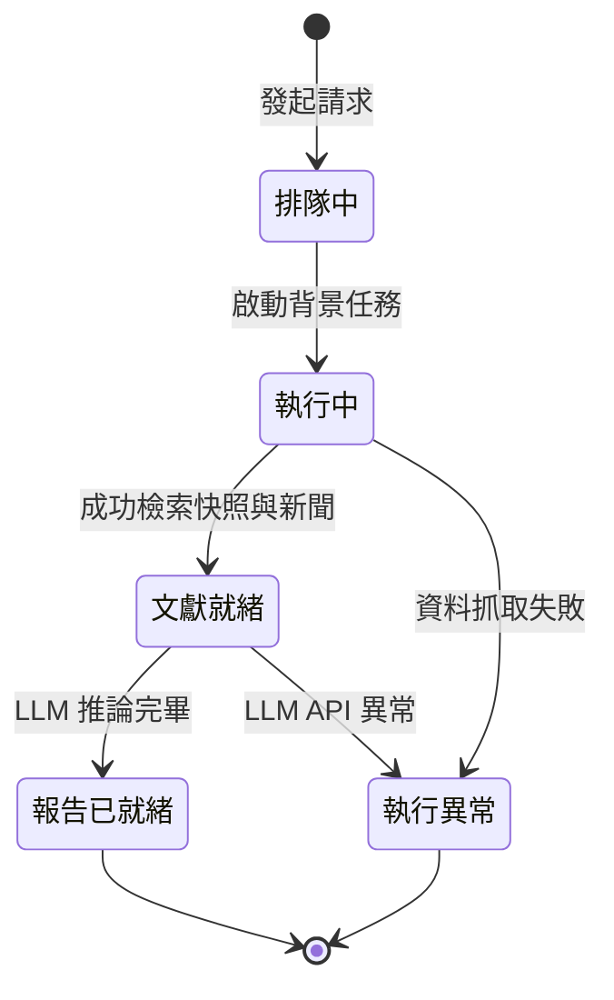

```mermaid
stateDiagram-v2
    %% 定義節點代號與中文標籤
    state "排隊中" as Queued
    state "執行中" as Running
    state "文獻就緒" as NewsReady
    state "報告已就緒" as ReportReady
    state "執行異常" as Failed
    
    [*] --> Queued : 發起請求
    
    Queued --> Running : 啟動背景任務
    
    Running --> NewsReady : 成功檢索快照與新聞
    NewsReady --> ReportReady : LLM 推論完畢
    
    %% 異常處理分支
    Running --> Failed : 資料抓取失敗
    NewsReady --> Failed : LLM API 異常
    
    ReportReady --> [*]
    Failed --> [*]
```
