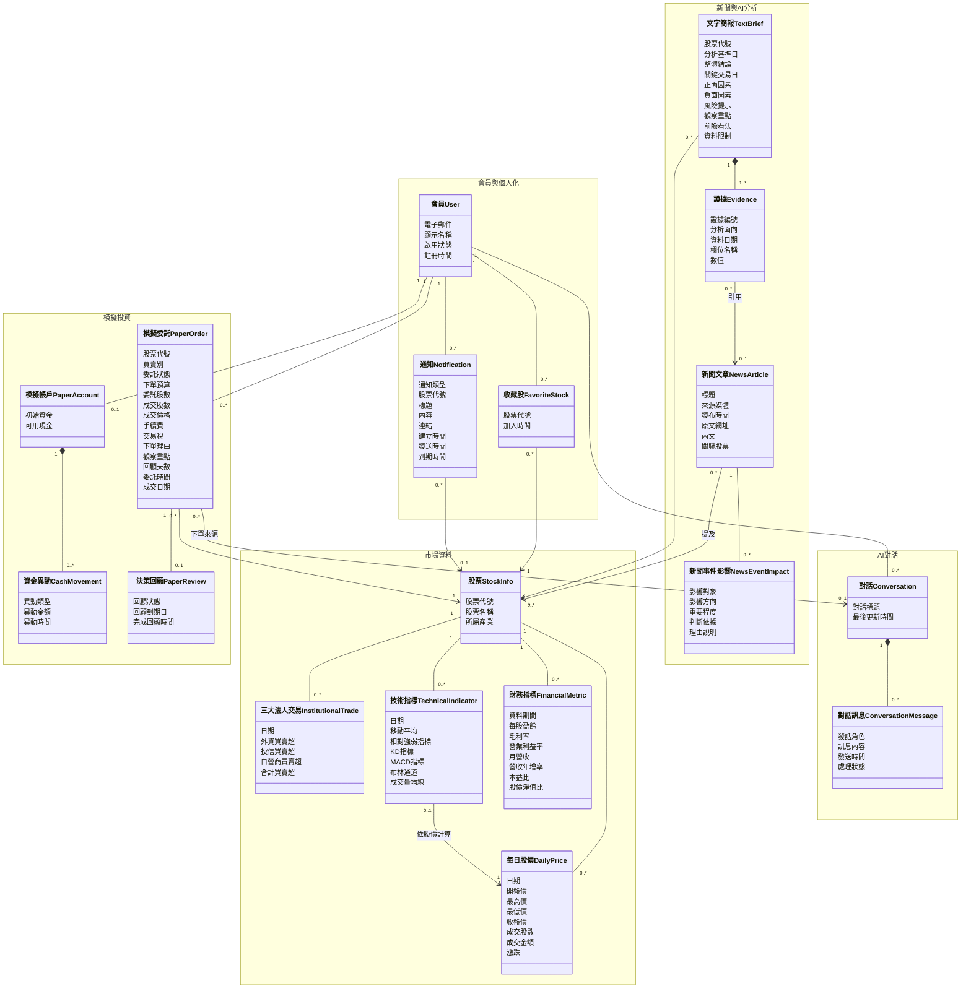

```mermaid
classDiagram
    direction TB

    namespace 會員與個人化 {
        class 會員User {
            電子郵件
            顯示名稱
            啟用狀態
            註冊時間
        }
        class 收藏股FavoriteStock {
            股票代號
            加入時間
        }
        class 通知Notification {
            通知類型
            股票代號
            標題
            內容
            連結
            建立時間
            發送時間
            到期時間
        }
    }

    namespace 模擬投資 {
        class 模擬帳戶PaperAccount {
            初始資金
            可用現金
        }
        class 資金異動CashMovement {
            異動類型
            異動金額
            異動時間
        }
        class 模擬委託PaperOrder {
            股票代號
            買賣別
            委託狀態
            下單預算
            委託股數
            成交股數
            成交價格
            手續費
            交易稅
            下單理由
            觀察重點
            回顧天數
            委託時間
            成交日期
        }
        class 決策回顧PaperReview {
            回顧狀態
            回顧到期日
            完成回顧時間
        }
    }

    namespace 市場資料 {
        class 股票StockInfo {
            股票代號
            股票名稱
            所屬產業
        }
        class 每日股價DailyPrice {
            日期
            開盤價
            最高價
            最低價
            收盤價
            成交股數
            成交金額
            漲跌
        }
        class 三大法人交易InstitutionalTrade {
            日期
            外資買賣超
            投信買賣超
            自營商買賣超
            合計買賣超
        }
        class 技術指標TechnicalIndicator {
            日期
            移動平均
            相對強弱指標
            KD指標
            MACD指標
            布林通道
            成交量均線
        }
        class 財務指標FinancialMetric {
            資料期間
            每股盈餘
            毛利率
            營業利益率
            月營收
            營收年增率
            本益比
            股價淨值比
        }
    }

    namespace 新聞與AI分析 {
        class 新聞文章NewsArticle {
            標題
            來源媒體
            發布時間
            原文網址
            內文
            關聯股票
        }
        class 新聞事件影響NewsEventImpact {
            影響對象
            影響方向
            重要程度
            判斷依據
            理由說明
        }
        class 證據Evidence {
            證據編號
            分析面向
            資料日期
            欄位名稱
            數值
        }
        class 文字簡報TextBrief {
            股票代號
            分析基準日
            整體結論
            關鍵交易日
            正面因素
            負面因素
            風險提示
            觀察重點
            前瞻看法
            資料限制
        }
    }

    namespace AI對話 {
        class 對話Conversation {
            對話標題
            最後更新時間
        }
        class 對話訊息ConversationMessage {
            發話角色
            訊息內容
            發送時間
            處理狀態
        }
    }

    會員User "1" -- "0..*" 收藏股FavoriteStock
    會員User "1" -- "0..*" 通知Notification
    會員User "1" -- "0..1" 模擬帳戶PaperAccount
    會員User "1" -- "0..*" 模擬委託PaperOrder
    會員User "1" -- "0..*" 對話Conversation

    模擬帳戶PaperAccount "1" *-- "0..*" 資金異動CashMovement
    模擬委託PaperOrder "1" -- "0..1" 決策回顧PaperReview
    模擬委託PaperOrder "0..*" --> "0..1" 對話Conversation : 下單來源
    對話Conversation "1" *-- "0..*" 對話訊息ConversationMessage

    收藏股FavoriteStock "0..*" --> "1" 股票StockInfo
    模擬委託PaperOrder "0..*" --> "1" 股票StockInfo
    通知Notification "0..*" --> "0..1" 股票StockInfo

    股票StockInfo "1" -- "0..*" 每日股價DailyPrice
    股票StockInfo "1" -- "0..*" 三大法人交易InstitutionalTrade
    股票StockInfo "1" -- "0..*" 技術指標TechnicalIndicator
    股票StockInfo "1" -- "0..*" 財務指標FinancialMetric
    技術指標TechnicalIndicator "0..1" --> "1" 每日股價DailyPrice : 依股價計算

    新聞文章NewsArticle "0..*" --> "0..*" 股票StockInfo : 提及
    新聞文章NewsArticle "1" -- "0..*" 新聞事件影響NewsEventImpact

    文字簡報TextBrief "0..*" --> "1" 股票StockInfo
    文字簡報TextBrief "1" *-- "1..*" 證據Evidence
    證據Evidence "0..*" --> "0..1" 新聞文章NewsArticle : 引用
```