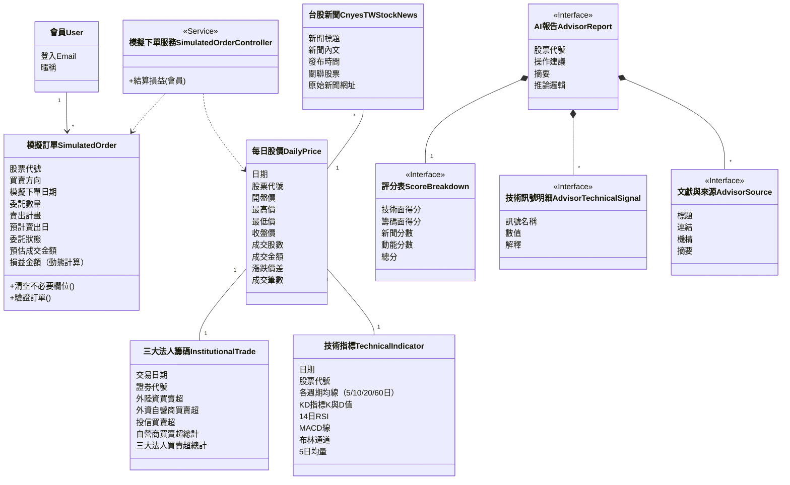

```mermaid
classDiagram
    %% ==========================================
    %% 模組 1：會員與下單業務 (User & Order)
    %% ==========================================
    
    class 會員User {
        登入Email
        暱稱
    }
    
    class 模擬訂單SimulatedOrder {
        股票代號
        買賣方向
        模擬下單日期
        委託數量
        賣出計畫
        預計賣出日
        委託狀態
        預估成交金額
        損益金額（動態計算）
        +清空不必要欄位()
        +驗證訂單()
    }
    
    class 模擬下單服務SimulatedOrderController {
        <<Service>>
        +結算損益(會員)
    }

    %% ==========================================
    %% 模組 2：市場大數據實體 (Market Data)
    %% ==========================================
    
    class 每日股價DailyPrice {
        日期
        股票代號
        開盤價
        最高價
        最低價
        收盤價
        成交股數
        成交金額
        漲跌價差
        成交筆數
    }
    
    class 三大法人籌碼InstitutionalTrade {
        交易日期
        證券代號
        外陸資買賣超
        外資自營商買賣超
        投信買賣超
        自營商買賣超總計
        三大法人買賣超總計
    }
    
    class 技術指標TechnicalIndicator {
        日期
        股票代號
        各週期均線（5/10/20/60日）
        KD指標K與D值
        14日RSI
        MACD線
        布林通道
        5日均量
    }

    class 台股新聞CnyesTWStockNews {
        新聞標題
        新聞內文
        發布時間
        關聯股票
        原始新聞網址
    }

    %% ==========================================
    %% 模組 3：AI 報告分析 (Advisor)
    %% ==========================================
    
    class AI報告AdvisorReport {
        <<Interface>>
        股票代號
        操作建議
        摘要
        推論邏輯
    }
    
    class 評分表ScoreBreakdown {
        <<Interface>>
        技術面得分
        籌碼面得分
        新聞分數
        動能分數
        總分
    }
    
    class 技術訊號明細AdvisorTechnicalSignal {
        <<Interface>>
        訊號名稱
        數值
        解釋
    }
    
    class 文獻與來源AdvisorSource {
        <<Interface>>
        標題
        連結
        機構
        摘要
    }

    %% ==========================================
    %% 實體關聯 (Relationships)
    %% ==========================================
    
    會員User "1" --> "*" 模擬訂單SimulatedOrder
    
    模擬下單服務SimulatedOrderController ..> 模擬訂單SimulatedOrder
    模擬下單服務SimulatedOrderController ..> 每日股價DailyPrice
    
    每日股價DailyPrice "1" -- "1" 三大法人籌碼InstitutionalTrade
    每日股價DailyPrice "1" -- "1" 技術指標TechnicalIndicator
    台股新聞CnyesTWStockNews "*" -- "1" 每日股價DailyPrice
    
    AI報告AdvisorReport *-- "1" 評分表ScoreBreakdown
    AI報告AdvisorReport *-- "*" 技術訊號明細AdvisorTechnicalSignal
    AI報告AdvisorReport *-- "*" 文獻與來源AdvisorSource
```