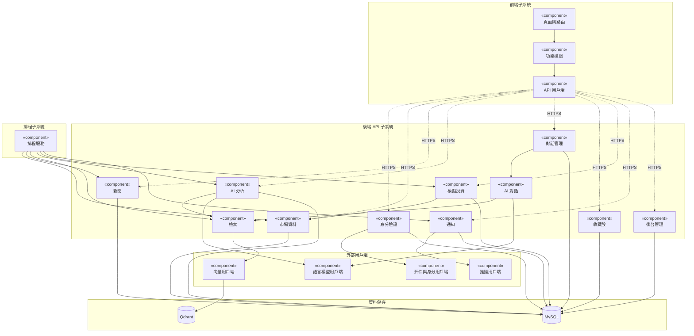

```mermaid
flowchart TB
 subgraph FE["前端子系統"]
  C_PAGE["«component»<br/>頁面與路由"]
  C_FEAT["«component»<br/>功能模組"]
  C_APICLI["«component»<br/>API 用戶端"]
 end
 subgraph BE["後端 API 子系統"]
  C_AUTH["«component»<br/>身分驗證"]
  C_MARKET["«component»<br/>市場資料"]
  C_NEWS["«component»<br/>新聞"]
  C_RETR["«component»<br/>檢索"]
  C_ANALY["«component»<br/>AI 分析"]
  C_CHAT["«component»<br/>AI 對話"]
  C_CONV["«component»<br/>對話管理"]
  C_FAV["«component»<br/>收藏股"]
  C_PAPER["«component»<br/>模擬投資"]
  C_NOTIFY["«component»<br/>通知"]
  C_ADMIN["«component»<br/>後台管理"]
 end
 subgraph JOB["排程子系統"]
  C_SCHED["«component»<br/>排程服務"]
 end
 subgraph CLI["外部用戶端"]
  C_LLM["«component»<br/>語言模型用戶端"]
  C_VEC["«component»<br/>向量用戶端"]
  C_FCM["«component»<br/>推播用戶端"]
  C_MAIL["«component»<br/>郵件與身分用戶端"]
 end
 subgraph DATA["資料儲存"]
  C_MYSQL[("MySQL")]
  C_QDRANT[("Qdrant")]
 end
 C_PAGE --> C_FEAT
 C_FEAT --> C_APICLI
 C_APICLI -. "HTTPS" .-> C_AUTH
 C_APICLI -. "HTTPS" .-> C_MARKET
 C_APICLI -. "HTTPS" .-> C_NEWS
 C_APICLI -. "HTTPS" .-> C_ANALY
 C_APICLI -. "HTTPS" .-> C_CONV
 C_APICLI -. "HTTPS" .-> C_FAV
 C_APICLI -. "HTTPS" .-> C_PAPER
 C_APICLI -. "HTTPS" .-> C_NOTIFY
 C_APICLI -. "HTTPS" .-> C_ADMIN
 C_CONV --> C_CHAT
 C_CHAT --> C_RETR
 C_CHAT --> C_LLM
 C_ANALY --> C_RETR
 C_ANALY --> C_LLM
 C_RETR --> C_VEC
 C_AUTH --> C_MAIL
 C_NOTIFY --> C_FCM
 C_PAPER --> C_MARKET
 C_SCHED --> C_MARKET
 C_SCHED --> C_NEWS
 C_SCHED --> C_RETR
 C_SCHED --> C_ANALY
 C_SCHED --> C_PAPER
 C_SCHED --> C_NOTIFY
 C_AUTH --> C_MYSQL
 C_MARKET --> C_MYSQL
 C_NEWS --> C_MYSQL
 C_ANALY --> C_MYSQL
 C_CONV --> C_MYSQL
 C_FAV --> C_MYSQL
 C_PAPER --> C_MYSQL
 C_NOTIFY --> C_MYSQL
 C_ADMIN --> C_MYSQL
 C_VEC --> C_QDRANT
```