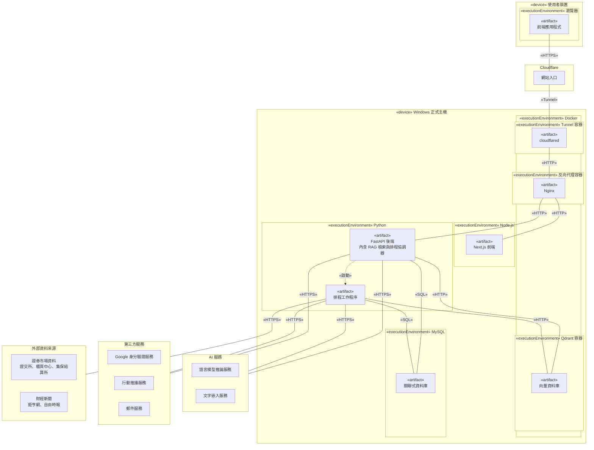

```mermaid
flowchart TB
 subgraph CLIENT["«device» 使用者裝置"]
  subgraph BROWSER["«executionEnvironment» 瀏覽器"]
   SPA["«artifact»<br/>前端應用程式"]
  end
 end
 subgraph CF["Cloudflare"]
  CFEDGE["網站入口"]
 end
 subgraph HOST["«device» Windows 正式主機"]
  subgraph DOCKER["«executionEnvironment» Docker"]
   subgraph TUNNELC["«executionEnvironment» Tunnel 容器"]
    CLOUDFLARED["«artifact»<br/>cloudflared"]
   end
   subgraph PROXYC["«executionEnvironment» 反向代理容器"]
    NGINX["«artifact»<br/>Nginx"]
   end
   subgraph QDRANTC["«executionEnvironment» Qdrant 容器"]
    QDRANT["«artifact»<br/>向量資料庫"]
   end
  end
  subgraph NODERT["«executionEnvironment» Node.js"]
   WEB["«artifact»<br/>Next.js 前端"]
  end
  subgraph PYRT["«executionEnvironment» Python"]
   API["«artifact»<br/>FastAPI 後端<br/>內含 RAG 檢索與排程協調器"]
   JOBS["«artifact»<br/>排程工作程序"]
  end
  subgraph MYSQLRT["«executionEnvironment» MySQL"]
   MYSQL["«artifact»<br/>關聯式資料庫"]
  end
 end
 subgraph EXTAI["AI 服務"]
  LLM["語言模型推論服務"]
  EMBED["文字嵌入服務"]
 end
 subgraph EXTSVC["第三方服務"]
  GOOGLE["Google 身分驗證服務"]
  FCM["行動推播服務"]
  SMTP["郵件服務"]
 end
 subgraph EXTDATA["外部資料來源"]
  MARKET["證券市場資料<br/>證交所、櫃買中心、集保結算所"]
  NEWS["財經新聞<br/>鉅亨網、自由時報"]
 end
 SPA ---|"«HTTPS»"| CFEDGE
 CFEDGE ---|"«Tunnel»"| CLOUDFLARED
 CLOUDFLARED ---|"«HTTP»"| NGINX
 NGINX ---|"«HTTP»"| WEB
 NGINX ---|"«HTTP»"| API
 API -.->|"«啟動»"| JOBS
 API ---|"«HTTP»"| QDRANT
 API ---|"«SQL»"| MYSQL
 API ---|"«HTTPS»"| EXTAI
 API ---|"«HTTPS»"| EXTSVC
 JOBS ---|"«HTTP»"| QDRANT
 JOBS ---|"«SQL»"| MYSQL
 JOBS ---|"«HTTPS»"| EXTAI
 JOBS ---|"«HTTPS»"| EXTSVC
 JOBS ---|"«HTTPS»"| EXTDATA
```