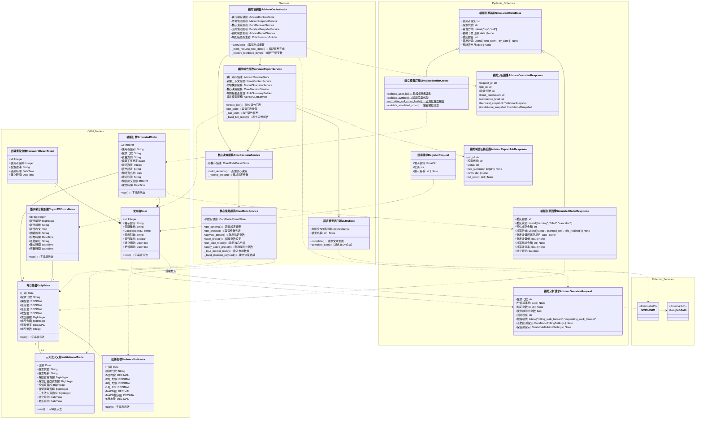

```mermaid
classDiagram

%% ========================================
%% 1. ORM Models (SQLAlchemy)
%% ========================================

namespace ORM_Models {

%% 系統使用者實體，儲存登入信箱與授權資訊
class 使用者User {
    +id: Integer
    +電子信箱: String
    +密碼雜湊: String
    +GoogleOpenID: String
    +顯示名稱: String
    +是否啟用: Boolean
    +建立時間: DateTime
    +更新時間: DateTime
    +repr(): 字串表示法
}

%% 模擬下單紀錄，儲存買賣委託、預計賣出日等
class 模擬訂單SimulatedOrder {
    +id: BIGINT
    +使用者識別: String
    +股票代號: String
    +買賣方向: String
    +模擬下單日期: Date
    +委託數量: Integer
    +賣出計畫: String
    +預計賣出日: Date
    +委託狀態: String
    +預估成交金額: BIGINT
    +建立時間: DateTime
    +repr(): 字串表示法
}

%% 密碼重設金鑰，儲存雜湊 Token 與過期時間
class 密碼重設金鑰PasswordResetToken {
    +id: Integer
    +使用者識別: Integer
    +金鑰雜湊: String
    +過期時間: DateTime
    +建立時間: DateTime
}

%% 股票每日交易價格與成交量資料表
class 每日股價DailyPrice {
    +日期: Date
    +股票代號: String
    +開盤價: DECIMAL
    +最高價: DECIMAL
    +最低價: DECIMAL
    +收盤價: DECIMAL
    +成交股數: BigInteger
    +成交金額: BigInteger
    +漲跌價差: DECIMAL
    +成交筆數: Integer
    +repr(): 字串表示法
}

%% 三大法人每日買賣超(外資/投信/自營商)資料表
class 三大法人交易InstitutionalTrade {
    +日期: Date
    +股票代號: String
    +股票名稱: String
    +外陸資買賣超: BigInteger
    +外資自營商買賣超: BigInteger
    +投信買賣超: BigInteger
    +自營商買賣超: BigInteger
    +三大法人買賣超: BigInteger
    +建立時間: DateTime
    +更新時間: DateTime
    +repr(): 字串表示法
}

%% 股票每日技術指標(MA/KD/RSI/MACD等)
class 技術指標TechnicalIndicator {
    +日期: Date
    +股票代號: String
    +5日均線: DECIMAL
    +20日均線: DECIMAL
    +60日均線: DECIMAL
    +14日RSI: DECIMAL
    +MACD線: DECIMAL
    +MACD柱狀圖: DECIMAL
    +5日均量: DECIMAL
    +repr(): 字串表示法
}

%% 鉅亨網台股新聞，儲存新聞標題與內文
class 鉅亨網台股新聞CnyesTWStockNews {
    +id: BigInteger
    +新聞編號: BigInteger
    +新聞標題: String
    +新聞內文: Text
    +關聯股票: String
    +發布時間: DateTime
    +原始網址: String
    +建立時間: DateTime
    +更新時間: DateTime
    +repr(): 字串表示法
}
}

%% ========================================
%% 2. Pydantic Schemas (DTO / Validation)
%% ========================================

namespace Pydantic_Schemas {

%% 註冊請求，負責驗證 Email 與密碼格式
class 註冊請求RegisterRequest {
    +電子信箱: EmailStr
    +密碼: str
    +顯示名稱: str | None
}

%% 模擬訂單基底，包含所有共用欄位
class 模擬訂單基底SimulatedOrderBase {
    +使用者識別: str
    +股票代號: str
    +買賣方向: Literal["buy", "sell"]
    +模擬下單日期: date | None
    +委託數量: int
    +賣出計畫: Literal["long_term", "by_date"] | None
    +預計賣出日: date | None
}

%% 建立模擬訂單的請求，繼承基底並加上驗證邏輯
class 建立模擬訂單SimulatedOrderCreate {
    +validate_user_id(): 驗證使用者識別$
    +validate_symbol(): 驗證股票代號$
    +normalize_sell_order_fields(): 正規化賣單欄位$
    +validate_simulated_order(): 驗證模擬訂單
}

%% 模擬訂單的回應結構，繼承基底並擴充系統產生之欄位
class 模擬訂單回應SimulatedOrderResponse {
    +委託編號: str
    +委託狀態: Literal["pending", "filled", "cancelled"]
    +預估成交金額: int
    +試算依據: Literal["latest", "planned_sell", "fifo_realized"] | None
    +參考收盤所屬交易日: date | None
    +參考收盤價: float | None
    +試算損益金額: int | None
    +試算收益率: float | None
    +建立時間: datetime
}

%% 顧問分析請求，包含回測參數與驗證模式設定
class 顧問分析請求AdvisorOverviewRequest {
    +股票代號: str
    +分析基準日: date | None
    +指定參數ID: str | None
    +使用啟用中參數: bool
    +回測視窗: str
    +驗證模式: Literal["rolling_walk_forward", "expanding_walk_forward"]
    +滾動回測設定: CoreModeRollingSettings | None
    +保留期設定: CoreModeHoldoutSettings | None
}

%% 顧問分析總覽回應，包含趨勢結論、分數與圖表資料
class 顧問分析回應AdvisorOverviewResponse {
    +request_id: str
    +job_id: str
    +股票代號: str
    +trend_conclusion: str
    +confidence_level: str
    +technical_snapshot: TechnicalSnapshot
    +institutional_snapshot: InstitutionalSnapshot
}

%% 顧問報告任務回應，包含完整的 LLM 報告與新聞
class 顧問報告任務回應AdvisorReportJobResponse {
    +job_id: str
    +股票代號: str
    +status: str
    +rule_summary: list[str] | None
    +news: dict | None
    +full_report: dict | None
}
}

%% ========================================
%% 3. Core Business Logic (Services)
%% ========================================

namespace Services {

%% 核心策略服務，負責執行趨勢回測、計算分數並優化策略參數
class 核心策略服務CoreModeService {
    -參數存儲庫: CoreModePresetStore
    +get_schema(): 取得設定綱要
    +get_presets(): 取得參數列表
    +activate_preset(): 啟用指定參數
    +save_preset(): 儲存參數設定
    +run_core_mode(): 執行核心分析
    +apply_active_preset(): 套用啟用中參數
    -_load_market_rows(): 載入市場數據
    -_build_decision_payload(): 建立決策結構$
}

%% 顧問協調器，負責整合市場快照、核心決策並調度背景報告
class 顧問協調器AdvisorOrchestrator {
    -執行期存儲庫: AdvisorRuntimeStore
    -市場快照服務: MarketSnapshotService
    -核心決策服務: CoreDecisionService
    -回測快照服務: BacktestSnapshotService
    -顧問報告服務: AdvisorReportService
    -規則摘要產生器: RuleSummaryBuilder
    +overview(): 取得分析概覽
    -_mark_request_task_done(): 標記任務完成
    -_resolve_lookback_days(): 解析回溯天數$
}

%% 核心決策服務，負責產生趨勢結論、信心等級與行動建議
class 核心決策服務CoreDecisionService {
    -參數存儲庫: CoreModePresetStore
    +build_decision(): 產生核心決策
    -_resolve_preset(): 解析指定參數
}

%% 顧問報告服務，負責串接新聞與LLM，在背景非同步生成完整的AI分析報告
class 顧問報告服務AdvisorReportService {
    -執行期存儲庫: AdvisorRuntimeStore
    -新聞上下文服務: NewsContextService
    -市場快照服務: MarketSnapshotService
    -核心決策服務: CoreDecisionService
    -規則摘要產生器: RuleSummaryBuilder
    -語言模型服務: AdvisorLLMService
    +create_job(): 建立報告任務
    +get_job(): 取得任務狀態
    -_run_job(): 執行報告任務
    -_build_full_report(): 產生完整報告
}

%% LLM代理客戶端，負責與外部OpenAI相容API溝通並解析JSON
class 語言模型客戶端LLMClient {
    +非同步API客戶端: AsyncOpenAI
    +模型名稱: str | None
    +complete(): 請求文本生成
    +complete_json(): 請求JSON生成
}
}

%% ========================================
%% 外部服務 (External APIs)
%% ========================================
namespace External_Services {
    class NVIDIANIM {
        <<External API>>
    }
    class GoogleOAuth {
        <<External API>>
    }
}

%% ========================================
%% 4. Dependencies & Associations (跨層級完整關聯)
%% ========================================

%% ORM 內部關聯
密碼重設金鑰PasswordResetToken "*" --* "1" 使用者User
模擬訂單SimulatedOrder "*" --* "1" 使用者User
模擬訂單SimulatedOrder "*" --> "1" 每日股價DailyPrice

%% 市場資料 ORM 關聯
    每日股價DailyPrice "1" -- "0..1" 三大法人交易InstitutionalTrade
    每日股價DailyPrice "1" -- "0..1" 技術指標TechnicalIndicator
鉅亨網台股新聞CnyesTWStockNews "*" -- "*" 每日股價DailyPrice

%% 定義 Schema 之間的繼承關係
模擬訂單基底SimulatedOrderBase <|-- 建立模擬訂單SimulatedOrderCreate
模擬訂單基底SimulatedOrderBase <|-- 模擬訂單回應SimulatedOrderResponse

%% 資料傳輸綁定 (Schema 與 ORM 映射)
建立模擬訂單SimulatedOrderCreate ..> 模擬訂單SimulatedOrder
模擬訂單SimulatedOrder ..> 模擬訂單回應SimulatedOrderResponse
註冊請求RegisterRequest ..> 使用者User

%% 系統操作關聯 (打通使用者、訂單與核心分析的連結)
使用者User ..> 顧問分析請求AdvisorOverviewRequest
模擬訂單回應SimulatedOrderResponse ..> 每日股價DailyPrice

%% Service 與 Schema (DTO) 的相依
顧問協調器AdvisorOrchestrator ..> 顧問分析請求AdvisorOverviewRequest
顧問協調器AdvisorOrchestrator ..> 顧問分析回應AdvisorOverviewResponse
顧問報告服務AdvisorReportService ..> 顧問報告任務回應AdvisorReportJobResponse

%% Service 與 ORM 的資料讀取相依 (DB CRUD)
核心策略服務CoreModeService ..> 每日股價DailyPrice
核心策略服務CoreModeService ..> 技術指標TechnicalIndicator
核心策略服務CoreModeService ..> 三大法人交易InstitutionalTrade
顧問報告服務AdvisorReportService ..> 鉅亨網台股新聞CnyesTWStockNews

%% Service 組件互相合成調用
顧問協調器AdvisorOrchestrator --> 核心決策服務CoreDecisionService
顧問協調器AdvisorOrchestrator --> 顧問報告服務AdvisorReportService
顧問報告服務AdvisorReportService --> 核心決策服務CoreDecisionService
顧問報告服務AdvisorReportService --> 語言模型客戶端LLMClient
核心決策服務CoreDecisionService --> 核心策略服務CoreModeService

%% 外部 API 依賴
語言模型客戶端LLMClient ..> NVIDIANIM
使用者User ..> GoogleOAuth : 授權登入

```
