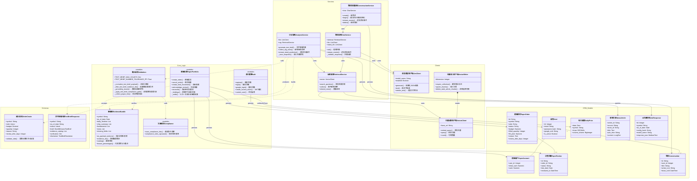

```mermaid
classDiagram
 direction TB
 namespace Schemas {
  class 建立委託OrderCreate {
   +symbol: String
   +side: Literal
   +budget: Decimal
   +quantity: Integer
   +reason: String
   +review_after_days: Integer
   +validate_side(): 買賣別欄位互斥檢查
  }
  class 文字簡報回應TextBriefResponse {
   +symbol: String
   +as_of_date: String
   +status: Literal
   +brief: StockBehaviorTextBrief
   +evidence_catalog: List
   +verification: Dict
   +disclaimer: TextBriefDisclaimer
  }
 }
 namespace Services {
  class 分析服務AnalysisService {
   +llm: LlmClient
   +rag: RetrievalService
   +generate_text_brief(): 文字簡報回應
   +collect_rag_news(): 新聞來源清單
   +stream_trend_prediction(): 逐段串流事件
   -_save_snapshot(): 寫入回應快照
  }
  class 對話服務ChatService {
   +retrieval: RetrievalService
   +llm: LlmClient
   +intent_llm: LlmClient
   +ask(): 提問回應
   +stream_events(): 逐段串流事件
   -_validate_response(): 回應檢核
  }
  class 檢索服務RetrievalService {
   +vector: VectorClient
   +search_question(): 問句相關切塊
   +collect(): 事件新聞清單
   +related_news(): 關聯新聞
  }
  class 對話管理服務ConversationService {
   +chat: ChatService
   +create(): 新對話
   +begin(): 建立回合並取得租約
   +stream_events(): 逐段串流事件
   +delete(): 刪除對話
  }
 }
 namespace Core_Logic {
  class 證據組EvidenceBundle {
   +symbol: String
   +as_of_date: Date
   +daily_timeline: List
   +chip_summary: List
   +fundamental: List
   +news: List
   +missing_fields: List
   +as_payload_sections(): 提示詞資料區塊
   +evidence_ids(): 證據編號集合
   +catalog(): 證據目錄
   +known_percentages(): 可核對百分比集合
  }
  class 輸出檢核Validation {
   <<module>>
   +TEXT_BRIEF_MAX_COUNTS: Dict
   +TEXT_BRIEF_NUMBER_TOLERANCE_PP: Float
   -_normalize_text_brief_payload(): 正規化簡報
   -_filter_text_brief_evidence_ids(): 過濾無效證據引用
   -_grounding_issues(): 數值與證據對照
   -_apply_text_brief_compliance_gate(): 逐條移除違規內容
   -_collect_jargon_hits(): 偵測專業術語
  }
  class 法遵規則Compliance {
   <<module>>
   +scan_compliance_hits(): 違規命中清單
   +compliance_rules_signature(): 規則版本簽章
  }
  class 模擬投資PaperPortfolio {
   <<module>>
   +create_order(): 模擬委託
   +cancel_order(): 取消結果
   +create_fund_movement(): 資金異動
   +acknowledge_review(): 完成回顧
   +reconcile(): 撮合待成交委託
   -_holdings(): 移動平均成本持股
   -_settle(): 以次一交易日收盤價結算
  }
  class 身分驗證Auth {
   <<module>>
   +register(): 權杖回應
   +login(): 權杖回應
   +google_login(): 權杖回應
   +create_access_token(): JWT權杖
   +current_user(): 目前會員
  }
 }
 namespace Clients {
  class 語言模型客戶端LlmClient {
   +model_name: String
   +enabled: Boolean
   +generate(): 結構化JSON結果
   +text(): 純文字結果
   +stream_text(): 逐段文字串流
  }
  class 向量檢索客戶端VectorClient {
   +base_url: String
   +embed_query(): 問句向量
   +query(): 相似切塊
   +count(): 切塊數量
  }
  class 向量寫入客戶端VectorWriter {
   +dimension: Integer
   +require_collection(): 確保集合存在
   +upsert_chunks(): 寫入切塊
   +delete_stale_article_chunks(): 清除過期切塊
  }
 }
 namespace ORM_Models {
  class 會員User {
   +id: Integer
   +email: String
   +password_hash: String
   +google_sub: String
   +is_active: Boolean
  }
  class 模擬帳戶PaperAccount {
   +user_id: Integer
   +initial_cash: Numeric
   +cash: Numeric
  }
  class 模擬委託PaperOrder {
   +id: String
   +symbol: String
   +side: String
   +status: String
   +budget: Numeric
   +filled_quantity: Integer
   +fill_price: Numeric
   +reason: Text
   +review_after_days: Integer
  }
  class 決策回顧PaperReview {
   +id: String
   +order_id: String
   +status: String
   +due_date: Date
   +reviewed_at: DateTime
  }
  class 每日股價DailyPrice {
   +date: Date
   +symbol: String
   +close: DECIMAL
   +volume_shares: BigInteger
  }
  class 新聞文章NewsArticle {
   +article_id: String
   +source: String
   +stock_id: String
   +title: Text
   +pub_time: String
   +content: LongText
  }
  class AI回應快照LlmResponse {
   +id: Integer
   +symbol: String
   +as_of_date: Date
   +config_hash: String
   +model_name: String
   +response_json: MediumText
  }
  class 對話Conversation {
   +id: String
   +user_id: Integer
   +title: String
   +active_turn: String
   +lease_until: DateTime
  }
 }
  分析服務AnalysisService --> 檢索服務RetrievalService : uses
 分析服務AnalysisService --> 語言模型客戶端LlmClient : uses
 分析服務AnalysisService ..> 證據組EvidenceBundle : builds
 分析服務AnalysisService ..> 輸出檢核Validation : calls
 分析服務AnalysisService ..> 文字簡報回應TextBriefResponse : produces
 分析服務AnalysisService --> AI回應快照LlmResponse : persists
 輸出檢核Validation ..> 證據組EvidenceBundle : verifies
 輸出檢核Validation ..> 法遵規則Compliance : calls
 對話服務ChatService --> 檢索服務RetrievalService : uses
 對話服務ChatService --> 語言模型客戶端LlmClient : uses
 對話管理服務ConversationService --> 對話服務ChatService : uses
 對話管理服務ConversationService --> 對話Conversation : persists
 檢索服務RetrievalService --> 向量檢索客戶端VectorClient : uses
 檢索服務RetrievalService --> 新聞文章NewsArticle : queries
 向量寫入客戶端VectorWriter *-- 向量檢索客戶端VectorClient : reader
 身分驗證Auth --> 會員User : persists
 模擬投資PaperPortfolio ..> 建立委託OrderCreate : accepts
 模擬投資PaperPortfolio --> 模擬帳戶PaperAccount : persists
 模擬投資PaperPortfolio --> 模擬委託PaperOrder : persists
 模擬投資PaperPortfolio --> 決策回顧PaperReview : persists
 模擬投資PaperPortfolio --> 每日股價DailyPrice : settlesAtClose
 模擬委託PaperOrder "1" -- "0..1" 決策回顧PaperReview
 會員User "1" -- "0..1" 模擬帳戶PaperAccount
 會員User "1" -- "0..*" 對話Conversation
```
