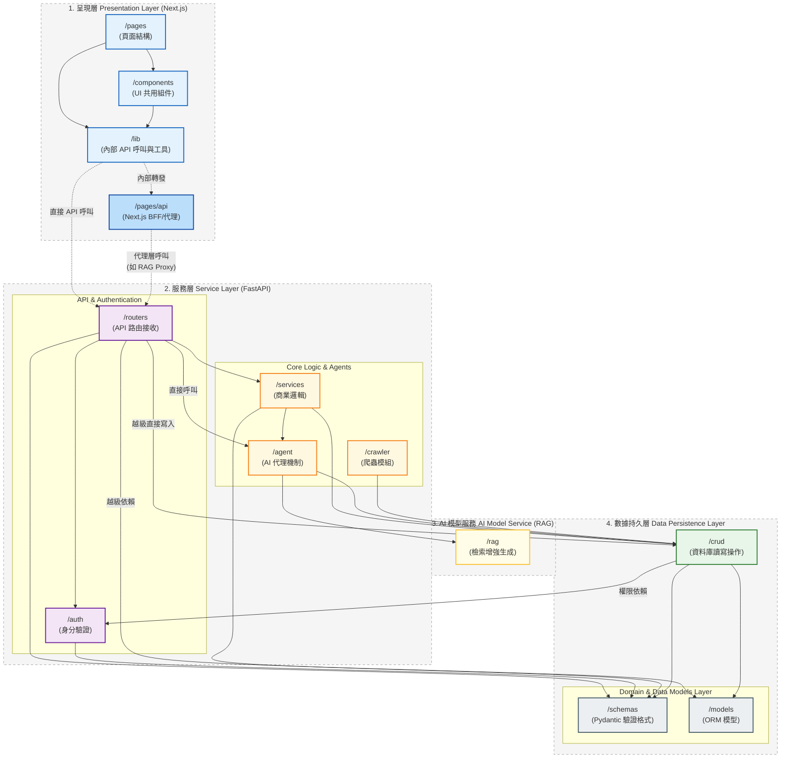

```mermaid
flowchart TB
    %% ==========================================
    %% 節點與框框外觀設定
    %% ==========================================
    classDef layerBox fill:#f5f5f5,stroke:#9e9e9e,stroke-width:1px,stroke-dasharray: 5 5;
    
    classDef frontendNode fill:#e3f2fd,stroke:#1565c0,stroke-width:2px;
    classDef bffNode fill:#bbdefb,stroke:#0d47a1,stroke-width:2px;
    classDef apiNode fill:#f3e5f5,stroke:#6a1b9a,stroke-width:2px;
    classDef bizNode fill:#fff8e1,stroke:#f57f17,stroke-width:2px;
    classDef aiNode fill:#fffde7,stroke:#fbc02d,stroke-width:2px;
    classDef dataNode fill:#e8f5e9,stroke:#2e7d32,stroke-width:2px;
    classDef coreNode fill:#eceff1,stroke:#455a64,stroke-width:2px;

    %% ==========================================
    %% 邏輯框框 (subgraphs)
    %% ==========================================

    %% 1. 呈現層 (Presentation Layer) - 前端
    subgraph PresentationLayer ["1. 呈現層 Presentation Layer (Next.js)"]
        direction TB
        F_Pages["/pages\n(頁面結構)"]:::frontendNode
        F_Components["/components\n(UI 共用組件)"]:::frontendNode
        F_Lib["/lib\n(內部 API 呼叫與工具)"]:::frontendNode
        F_API["/pages/api\n(Next.js BFF/代理)"]:::bffNode
        
        F_Pages --> F_Components
        F_Pages --> F_Lib
        F_Components --> F_Lib
        F_Lib -. "內部轉發" .-> F_API
    end

    %% 2. 服務層 (Service Layer) - API 與業務邏輯
    subgraph ServiceLayer ["2. 服務層 Service Layer (FastAPI)"]
        direction TB
        subgraph APIAuthGroup ["API & Authentication"]
            B_Routers["/routers\n(API 路由接收)"]:::apiNode
            B_Auth["/auth\n(身分驗證)"]:::apiNode
        end

        subgraph LogicGroup ["Core Logic & Agents"]
            B_Services["/services\n(商業邏輯)"]:::bizNode
            B_Agent["/agent\n(AI 代理機制)"]:::bizNode
            B_Crawler["/crawler\n(爬蟲模組)"]:::bizNode
        end
    end

    %% 3. AI 模型服務層 (AI Model Service)
    subgraph AIZone ["3. AI 模型服務 AI Model Service (RAG)"]
        B_RAG["/rag\n(檢索增強生成)"]:::aiNode
    end

    %% 4. 數據持久層 (Data Persistence Layer)
    subgraph DataZone ["4. 數據持久層 Data Persistence Layer"]
        B_CRUD["/crud\n(資料庫讀寫操作)"]:::dataNode
        
        subgraph CoreZone ["Domain & Data Models Layer"]
            B_Schemas["/schemas\n(Pydantic 驗證格式)"]:::coreNode
            B_Models["/models\n(ORM 模型)"]:::coreNode
        end
    end

    %% ==========================================
    %% 實體之間的連線關係
    %% ==========================================

    %% 跨網路呼叫
    F_Lib -. "直接 API 呼叫" .-> B_Routers
    F_API -. "代理層呼叫\n(如 RAG Proxy)" .-> B_Routers

    %% 後端層級流動與「越層呼叫(現況)」
    B_Routers --> B_Services
    B_Routers --> B_Auth
    B_Routers --> B_Schemas
    B_Routers -->|直接呼叫| B_Agent
    B_Routers -->|越級直接寫入| B_CRUD
    B_Routers -->|越級依賴| B_Models
    
    B_Auth --> B_Schemas

    %% 服務層呼叫
    B_Services --> B_Agent
    B_Services --> B_CRUD
    B_Services --> B_Schemas
    
    %% 代理呼叫
    B_Agent --> B_RAG
    B_Agent --> B_CRUD
    
    B_Crawler --> B_CRUD
    
    %% CRUD 底層
    B_CRUD --> B_Models
    B_CRUD --> B_Schemas
    B_CRUD -->|權限依賴| B_Auth

    %% 應用框線提示
    class PresentationLayer,ServiceLayer,AIZone,DataZone layerBox;
```