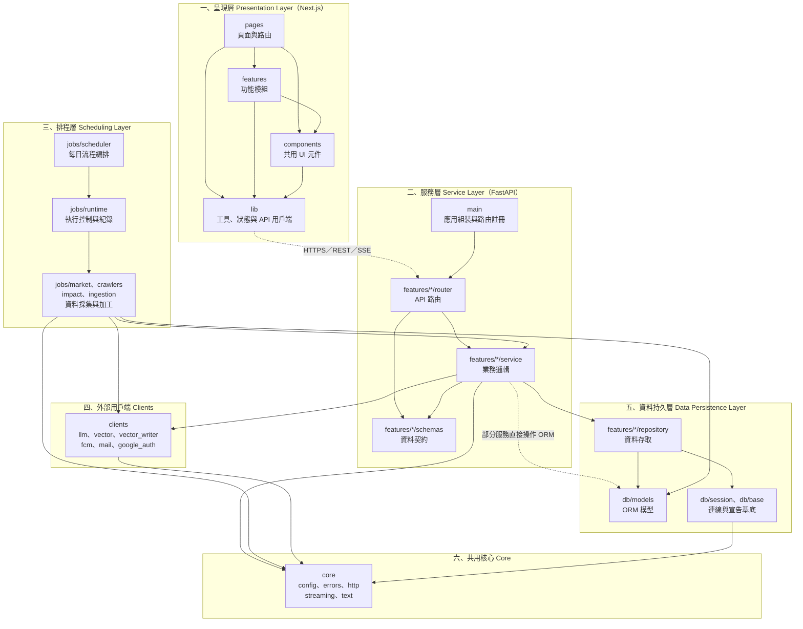

```mermaid
flowchart TB
 subgraph L1["一、呈現層 Presentation Layer（Next.js）"]
  FE_PAGES["pages<br/>頁面與路由"]
  FE_FEAT["features<br/>功能模組"]
  FE_COMP["components<br/>共用 UI 元件"]
  FE_LIB["lib<br/>工具、狀態與 API 用戶端"]
 end
 subgraph L2["二、服務層 Service Layer（FastAPI）"]
  BE_MAIN["main<br/>應用組裝與路由註冊"]
  BE_ROUTER["features/*/router<br/>API 路由"]
  BE_SCHEMA["features/*/schemas<br/>資料契約"]
  BE_SERVICE["features/*/service<br/>業務邏輯"]
 end
 subgraph L3["三、排程層 Scheduling Layer"]
  JOB_SCHED["jobs/scheduler<br/>每日流程編排"]
  JOB_RUNTIME["jobs/runtime<br/>執行控制與紀錄"]
  JOB_TASKS["jobs/market、crawlers<br/>impact、ingestion<br/>資料採集與加工"]
 end
 subgraph L4["四、外部用戶端 Clients"]
  CLIENTS["clients<br/>llm、vector、vector_writer<br/>fcm、mail、google_auth"]
 end
 subgraph L5["五、資料持久層 Data Persistence Layer"]
  BE_REPO["features/*/repository<br/>資料存取"]
  DB_MODEL["db/models<br/>ORM 模型"]
  DB_SESSION["db/session、db/base<br/>連線與宣告基底"]
 end
 subgraph L6["六、共用核心 Core"]
  CORE["core<br/>config、errors、http<br/>streaming、text"]
 end
 FE_PAGES --> FE_FEAT
 FE_PAGES --> FE_COMP
 FE_PAGES --> FE_LIB
 FE_FEAT --> FE_COMP
 FE_FEAT --> FE_LIB
 FE_COMP --> FE_LIB
 FE_LIB -. "HTTPS／REST／SSE" .-> BE_ROUTER
 BE_MAIN --> BE_ROUTER
 BE_ROUTER --> BE_SERVICE
 BE_ROUTER --> BE_SCHEMA
 BE_SERVICE --> BE_REPO
 BE_SERVICE --> BE_SCHEMA
 BE_SERVICE --> CLIENTS
 BE_SERVICE -. "部分服務直接操作 ORM" .-> DB_MODEL
 BE_REPO --> DB_MODEL
 BE_REPO --> DB_SESSION
 JOB_SCHED --> JOB_RUNTIME
 JOB_RUNTIME --> JOB_TASKS
 JOB_TASKS --> BE_SERVICE
 JOB_TASKS --> DB_MODEL
 JOB_TASKS --> CLIENTS
 BE_SERVICE --> CORE
 JOB_TASKS --> CORE
 CLIENTS --> CORE
 DB_SESSION --> CORE
```