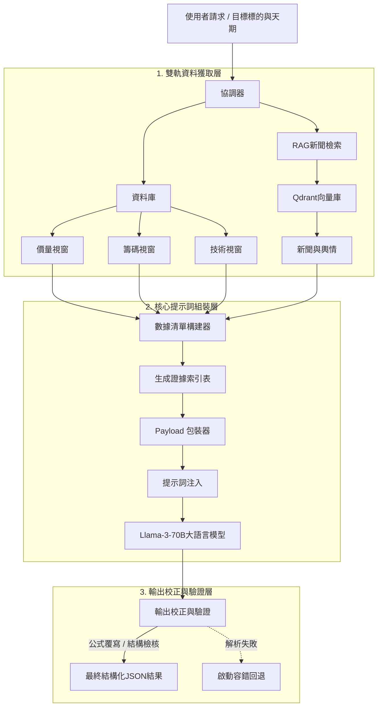

```mermaid
graph TD
    A["使用者請求 / 目標標的與天期"] --> B["協調器"]

    subgraph step1 ["1. 雙軌資料獲取層"]
        B --> C["資料庫"]
        B --> D["RAG新聞檢索"]
        C --> C1["價量視窗"]
        C --> C2["籌碼視窗"]
        C --> C3["技術視窗"]
        D --> D1["Qdrant向量庫"]
        D1 --> D2["新聞與輿情"]
    end

    subgraph step2 ["2. 核心提示詞組裝層"]
        C1 --> E["數據清單構建器"]
        C2 --> E
        C3 --> E
        D2 --> E
        E --> F["生成證據索引表"]
        F --> G["Payload 包裝器"]
        G --> H["提示詞注入"]
        H --> I["Llama-3-70B大語言模型"]
    end

    subgraph step3 ["3. 輸出校正與驗證層"]
        I --> J["輸出校正與驗證"]
        J -->|"公式覆寫 / 結構檢核"| K["最終結構化JSON結果"]
        J -.->|"解析失敗"| L["啟動容錯回退"]
    end
```