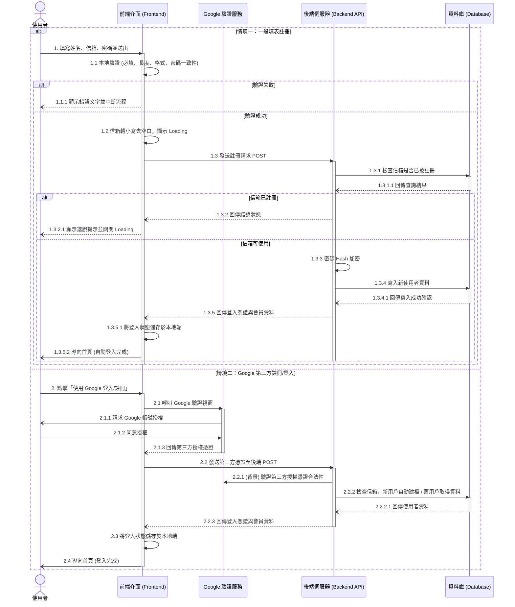
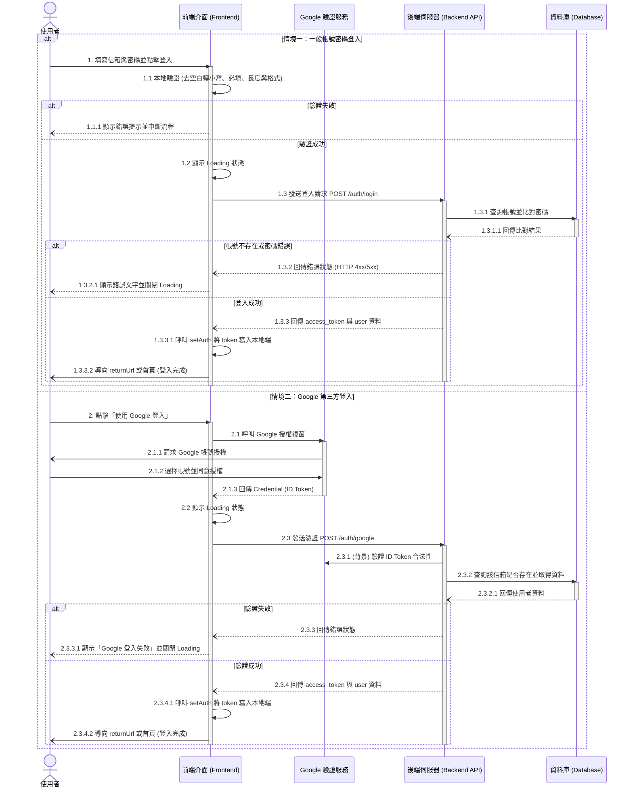
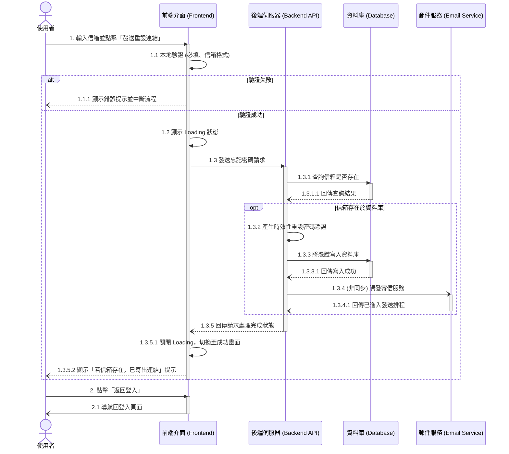
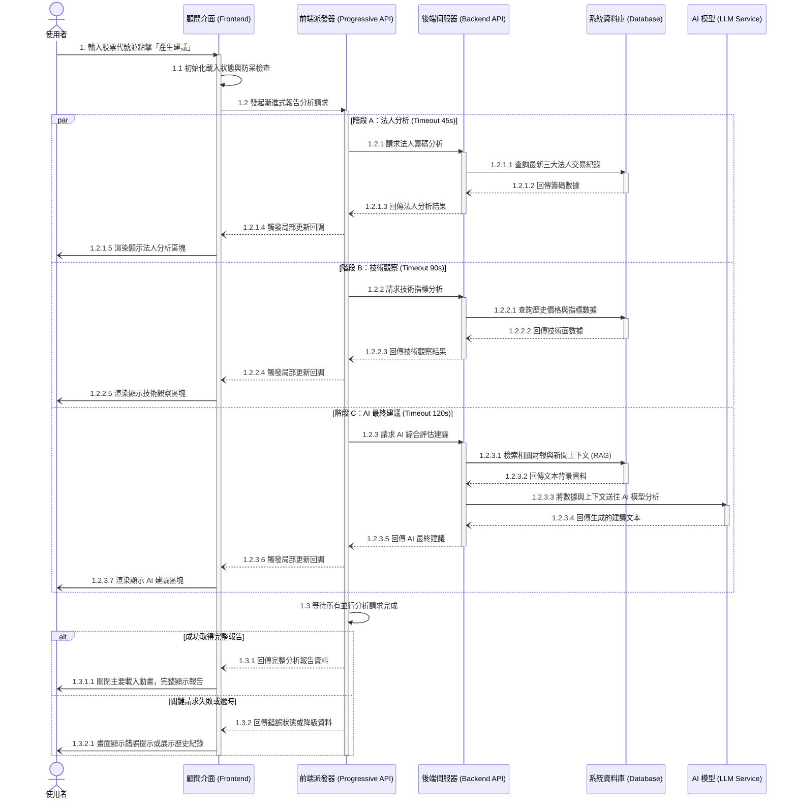
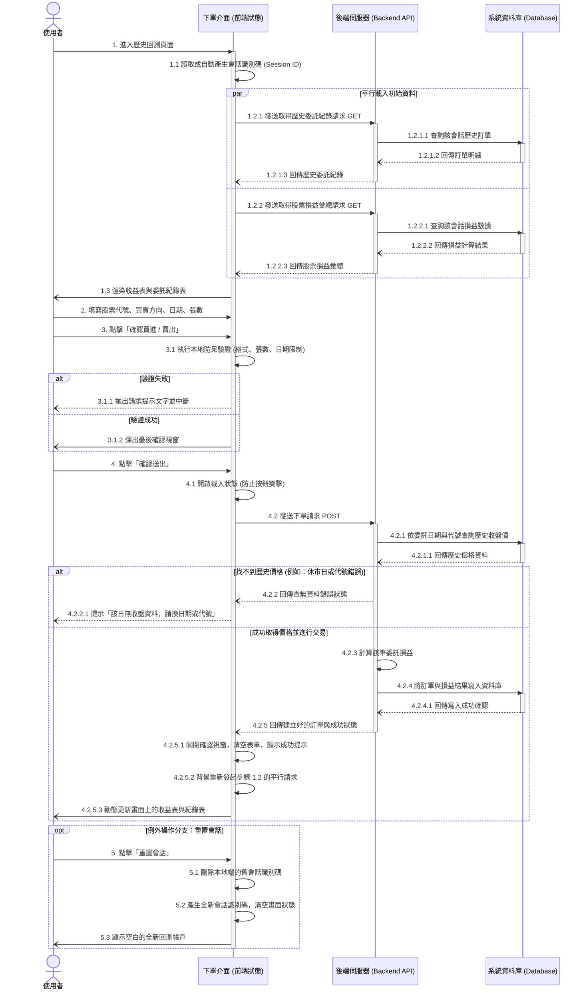
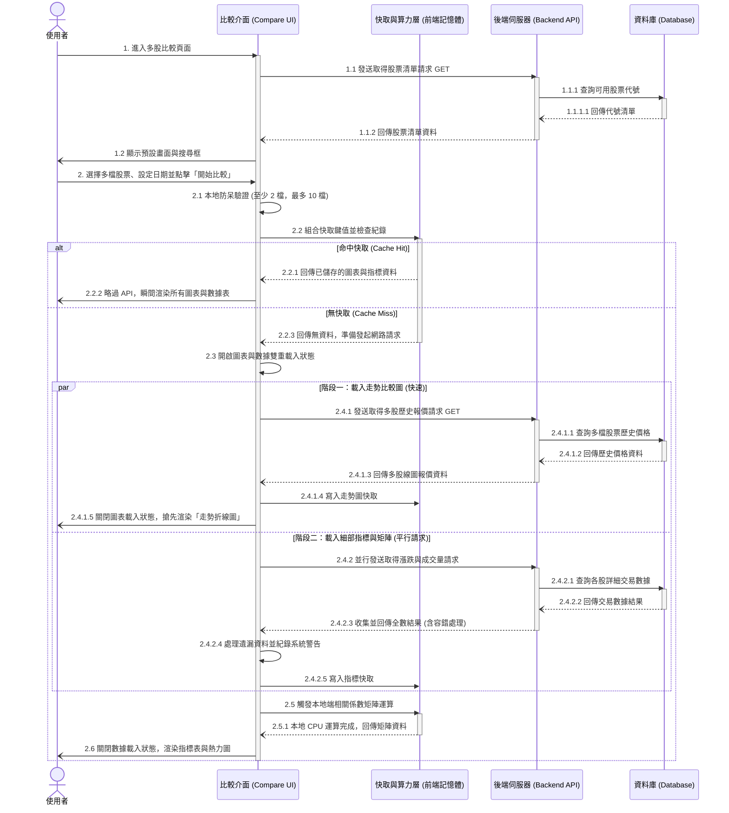

# 股海明燈 - Sequential diagram

## 1. 會員註冊

```mermaid
sequenceDiagram
    actor User as 使用者
    participant FE as 前端介面 (Frontend)
    participant Google as Google 驗證服務
    participant API as 後端伺服器 (Backend API)
    participant DB as 資料庫 (Database)

    alt 情境一：一般填表註冊
        %% 同步請求 (實心)
        User->>FE: 1. 填寫姓名、信箱、密碼並送出
        activate FE
        FE->>FE: 1.1 本地驗證 (必填、長度、格式、密碼一致性)
        alt 驗證失敗
            %% 回應訊息 (虛線+空心)
            FE--)User: 1.1.1 顯示錯誤文字並中斷流程
        else 驗證成功
            FE->>FE: 1.2 信箱轉小寫去空白，顯示 Loading
            FE->>API: 1.3 發送註冊請求 POST
            activate API
            
            API->>DB: 1.3.1 檢查信箱是否已被註冊
            activate DB
            DB--)API: 1.3.1.1 回傳查詢結果
            deactivate DB
            
            alt 信箱已註冊
                API--)FE: 1.3.2 回傳錯誤狀態
                FE--)User: 1.3.2.1 顯示錯誤提示並關閉 Loading
            else 信箱可使用
                API->>API: 1.3.3 密碼 Hash 加密
                
                %% 💡 修正重點：補上資料庫的生命線與回傳確認
                API->>DB: 1.3.4 寫入新使用者資料
                activate DB
                DB--)API: 1.3.4.1 回傳寫入成功確認
                deactivate DB
                
                %% 💡 抽象化：拿掉具體變數與函式名
                API--)FE: 1.3.5 回傳登入憑證與會員資料
                FE->>FE: 1.3.5.1 將登入狀態儲存於本地端
                %% 非同步/觸發跳轉 (實線+空心)
                FE-)User: 1.3.5.2 導向首頁 (自動登入完成)
            end
            deactivate API
        end
        deactivate FE

    else 情境二：Google 第三方註冊/登入
        User->>FE: 2. 點擊「使用 Google 登入/註冊」
        activate FE
        FE->>Google: 2.1 呼叫 Google 驗證視窗
        activate Google
        %% 彈出視窗屬於非同步觸發
        Google-)User: 2.1.1 請求 Google 帳號授權
        User->>Google: 2.1.2 同意授權
        
        %% 💡 抽象化：改為通用的憑證描述
        Google--)FE: 2.1.3 回傳第三方授權憑證
        deactivate Google
        
        FE->>API: 2.2 發送第三方憑證至後端 POST
        activate API
        API->>Google: 2.2.1 (背景) 驗證第三方授權憑證合法性
        
        %% 💡 修正重點：補上資料庫的生命線與回傳！
        API->>DB: 2.2.2 檢查信箱，新用戶自動建檔 / 舊用戶取得資料
        activate DB
        DB--)API: 2.2.2.1 回傳使用者資料
        deactivate DB
        
        API--)FE: 2.2.3 回傳登入憑證與會員資料
        deactivate API
        
        FE->>FE: 2.3 將登入狀態儲存於本地端
        FE-)User: 2.4 導向首頁 (登入完成)
        deactivate FE
    end
```

## 2. 會員登入

```mermaid
sequenceDiagram
    actor User as 使用者
    participant FE as 前端介面 (Frontend)
    participant Google as Google 驗證服務
    participant API as 後端伺服器 (Backend API)
    participant DB as 資料庫 (Database)

    alt 情境一：一般帳號密碼登入
        User->>FE: 1. 填寫信箱與密碼並點擊登入
        activate FE
        FE->>FE: 1.1 本地驗證 (去空白轉小寫、必填、長度與格式)
        alt 驗證失敗
            FE--)User: 1.1.1 顯示錯誤提示並中斷流程
        else 驗證成功
            FE->>FE: 1.2 顯示 Loading 狀態
            FE->>API: 1.3 發送登入請求 POST /auth/login
            activate API
            
            API->>DB: 1.3.1 查詢帳號並比對密碼
            activate DB
            DB--)API: 1.3.1.1 回傳比對結果
            deactivate DB
            
            alt 帳號不存在或密碼錯誤
                API--)FE: 1.3.2 回傳錯誤狀態 (HTTP 4xx/5xx)
                FE--)User: 1.3.2.1 顯示錯誤文字並關閉 Loading
            else 登入成功
                API--)FE: 1.3.3 回傳 access_token 與 user 資料
                FE->>FE: 1.3.3.1 呼叫 setAuth 將 token 寫入本地端
                FE-)User: 1.3.3.2 導向 returnUrl 或首頁 (登入完成)
            end
            deactivate API
        end
        deactivate FE

    else 情境二：Google 第三方登入
        User->>FE: 2. 點擊「使用 Google 登入」
        activate FE
        FE->>Google: 2.1 呼叫 Google 授權視窗
        activate Google
        Google-)User: 2.1.1 請求 Google 帳號授權
        User->>Google: 2.1.2 選擇帳號並同意授權
        Google--)FE: 2.1.3 回傳 Credential (ID Token)
        deactivate Google
        
        FE->>FE: 2.2 顯示 Loading 狀態
        FE->>API: 2.3 發送憑證 POST /auth/google
        activate API
        API->>Google: 2.3.1 (背景) 驗證 ID Token 合法性
        API->>DB: 2.3.2 查詢該信箱是否存在並取得資料
        activate DB
        DB--)API: 2.3.2.1 回傳使用者資料
        deactivate DB
        
        alt 驗證失敗
            API--)FE: 2.3.3 回傳錯誤狀態
            FE--)User: 2.3.3.1 顯示「Google 登入失敗」並關閉 Loading
        else 驗證成功
            API--)FE: 2.3.4 回傳 access_token 與 user 資料
            FE->>FE: 2.3.4.1 呼叫 setAuth 將 token 寫入本地端
            FE-)User: 2.3.4.2 導向 returnUrl 或首頁 (登入完成)
        end
        deactivate API
        deactivate FE
    end
```

## 3. 忘記密碼

```mermaid
sequenceDiagram
    actor User as 使用者
    participant FE as 前端介面 (Frontend)
    participant API as 後端伺服器 (Backend API)
    participant DB as 資料庫 (Database)
    participant Email as 郵件服務 (Email Service)

    User->>FE: 1. 輸入信箱並點擊「發送重設連結」
    activate FE
    FE->>FE: 1.1 本地驗證 (必填、信箱格式)
    
    alt 驗證失敗
        %% 回應錯誤並中斷
        FE--)User: 1.1.1 顯示錯誤提示並中斷流程
    else 驗證成功
        FE->>FE: 1.2 顯示 Loading 狀態
        FE->>API: 1.3 發送忘記密碼請求
        activate API
        
        API->>DB: 1.3.1 查詢信箱是否存在
        activate DB
        DB--)API: 1.3.1.1 回傳查詢結果
        deactivate DB
        
        %% 💡 修正這裡：改用 opt (Optional) 取代沒有 else 的 alt
        opt 信箱存在於資料庫
            API->>API: 1.3.2 產生時效性重設密碼憑證
            API->>DB: 1.3.3 將憑證寫入資料庫
            activate DB
            DB--)API: 1.3.3.1 回傳寫入成功
            deactivate DB
            
            API-)Email: 1.3.4 (非同步) 觸發寄信服務
            activate Email
            Email--)API: 1.3.4.1 回傳已進入發送排程
            deactivate Email
        end
        
        %% 無論剛才 opt 有沒有跑，最後都會走到這裡
        API--)FE: 1.3.5 回傳請求處理完成狀態
        deactivate API
        
        FE->>FE: 1.3.5.1 關閉 Loading，切換至成功畫面
        FE--)User: 1.3.5.2 顯示「若信箱存在，已寄出連結」提示
    end
    deactivate FE

    User->>FE: 2. 點擊「返回登入」
    activate FE
    FE-)User: 2.1 導航回登入頁面
    deactivate FE
```
## 4. 投資顧問

```mermaid
sequenceDiagram
    actor User as 使用者
    participant UI as 顧問介面 (Frontend)
    participant FE_API as 前端派發器 (Progressive API)
    participant API_BE as 後端伺服器 (Backend API)
    participant DB as 系統資料庫 (Database)
    participant AI as AI 模型 (LLM Service)

    User->>UI: 1. 輸入股票代號並點擊「產生建議」
    activate UI
    UI->>UI: 1.1 初始化載入狀態與防呆檢查
    UI->>FE_API: 1.2 發起漸進式報告分析請求
    activate FE_API

    %% 平行處理區塊 (Concurrent Requests)
    par 階段 A：法人分析 (Timeout 45s)
        FE_API->>API_BE: 1.2.1 請求法人籌碼分析
        activate API_BE
        API_BE->>DB: 1.2.1.1 查詢最新三大法人交易紀錄
        activate DB
        DB--)API_BE: 1.2.1.2 回傳籌碼數據
        deactivate DB
        API_BE--)FE_API: 1.2.1.3 回傳法人分析結果
        deactivate API_BE
        FE_API--)UI: 1.2.1.4 觸發局部更新回調
        UI-)User: 1.2.1.5 渲染顯示法人分析區塊
    and 階段 B：技術觀察 (Timeout 90s)
        FE_API->>API_BE: 1.2.2 請求技術指標分析
        activate API_BE
        API_BE->>DB: 1.2.2.1 查詢歷史價格與指標數據
        activate DB
        DB--)API_BE: 1.2.2.2 回傳技術面數據
        deactivate DB
        API_BE--)FE_API: 1.2.2.3 回傳技術觀察結果
        deactivate API_BE
        FE_API--)UI: 1.2.2.4 觸發局部更新回調
        UI-)User: 1.2.2.5 渲染顯示技術觀察區塊
    and 階段 C：AI 最終建議 (Timeout 120s)
        FE_API->>API_BE: 1.2.3 請求 AI 綜合評估建議
        activate API_BE
        API_BE->>DB: 1.2.3.1 檢索相關財報與新聞上下文 (RAG)
        activate DB
        DB--)API_BE: 1.2.3.2 回傳文本背景資料
        deactivate DB
        API_BE->>AI: 1.2.3.3 將數據與上下文送往 AI 模型分析
        activate AI
        AI--)API_BE: 1.2.3.4 回傳生成的建議文本
        deactivate AI
        API_BE--)FE_API: 1.2.3.5 回傳 AI 最終建議
        deactivate API_BE
        FE_API--)UI: 1.2.3.6 觸發局部更新回調
        UI-)User: 1.2.3.7 渲染顯示 AI 建議區塊
    end

    FE_API->>FE_API: 1.3 等待所有並行分析請求完成

    alt 成功取得完整報告
        FE_API--)UI: 1.3.1 回傳完整分析報告資料
        UI-)User: 1.3.1.1 關閉主要載入動畫，完整顯示報告
    else 關鍵請求失敗或逾時
        FE_API--)UI: 1.3.2 回傳錯誤狀態或降級資料
        UI-)User: 1.3.2.1 畫面顯示錯誤提示或展示歷史紀錄
    end

    deactivate FE_API
    deactivate UI
```
## 5. 歷史回測

```mermaid
sequenceDiagram
    actor User as 使用者
    participant UI as 下單介面 (前端狀態)
    participant OrderAPI as 後端伺服器 (Backend API)
    %% 💡 修正重點：正名為統一的資料庫，並全程參與
    participant DB as 系統資料庫 (Database)

    %% 進入頁面：初始化與平行資料載入
    User->>UI: 1. 進入歷史回測頁面
    activate UI
    %% 💡 抽象化：Session ID 轉譯
    UI->>UI: 1.1 讀取或自動產生會話識別碼 (Session ID)
    
    par 平行載入初始資料
        UI->>OrderAPI: 1.2.1 發送取得歷史委託紀錄請求 GET
        activate OrderAPI
        %% 💡 補漏：加上資料庫查詢與回傳
        OrderAPI->>DB: 1.2.1.1 查詢該會話歷史訂單
        activate DB
        DB--)OrderAPI: 1.2.1.2 回傳訂單明細
        deactivate DB
        OrderAPI--)UI: 1.2.1.3 回傳歷史委託紀錄
        deactivate OrderAPI
    and 
        UI->>OrderAPI: 1.2.2 發送取得股票損益彙總請求 GET
        activate OrderAPI
        %% 💡 補漏：加上資料庫查詢與回傳
        OrderAPI->>DB: 1.2.2.1 查詢該會話損益數據
        activate DB
        DB--)OrderAPI: 1.2.2.2 回傳損益計算結果
        deactivate DB
        OrderAPI--)UI: 1.2.2.3 回傳股票損益彙總
        deactivate OrderAPI
    end
    UI-)User: 1.3 渲染收益表與委託紀錄表
    
    %% 使用者填單與前端驗證
    User->>UI: 2. 填寫股票代號、買賣方向、日期、張數
    User->>UI: 3. 點擊「確認買進 / 賣出」
    UI->>UI: 3.1 執行本地防呆驗證 (格式、張數、日期限制)
    
    alt 驗證失敗
        UI--)User: 3.1.1 拋出錯誤提示文字並中斷
    else 驗證成功
        %% 💡 抽象化：Dialog 轉譯
        UI-)User: 3.1.2 彈出最後確認視窗
    end
    
    %% 確認送出與後端處理
    User->>UI: 4. 點擊「確認送出」
    UI->>UI: 4.1 開啟載入狀態 (防止按鈕雙擊)
    UI->>OrderAPI: 4.2 發送下單請求 POST
    activate OrderAPI
    
    OrderAPI->>DB: 4.2.1 依委託日期與代號查詢歷史收盤價
    activate DB
    DB--)OrderAPI: 4.2.1.1 回傳歷史價格資料
    deactivate DB
    
    alt 找不到歷史價格 (例如：休市日或代號錯誤)
        OrderAPI--)UI: 4.2.2 回傳查無資料錯誤狀態
        UI--)User: 4.2.2.1 提示「該日無收盤資料，請換日期或代號」
    else 成功取得價格並進行交易
        OrderAPI->>OrderAPI: 4.2.3 計算該筆委託損益
        %% 💡 補漏：真正將訂單「寫入」資料庫的動作
        OrderAPI->>DB: 4.2.4 將訂單與損益結果寫入資料庫
        activate DB
        DB--)OrderAPI: 4.2.4.1 回傳寫入成功確認
        deactivate DB
        
        OrderAPI--)UI: 4.2.5 回傳建立好的訂單與成功狀態
        deactivate OrderAPI
        
        UI->>UI: 4.2.5.1 關閉確認視窗，清空表單，顯示成功提示
        UI->>UI: 4.2.5.2 背景重新發起步驟 1.2 的平行請求
        UI-)User: 4.2.5.3 動態更新畫面上的收益表與紀錄表
    end
    
    %% 例外分支：重置 Session
    opt 例外操作分支：重置會話
        User->>UI: 5. 點擊「重置會話」
        %% 💡 抽象化：LocalStorage 轉譯
        UI->>UI: 5.1 刪除本地端的舊會話識別碼
        UI->>UI: 5.2 產生全新會話識別碼，清空畫面狀態
        UI-)User: 5.3 顯示空白的全新回測帳戶
    end
    deactivate UI
```
## 6. 多股比較

```mermaid
sequenceDiagram
    actor User as 使用者
    participant UI as 比較介面 (Compare UI)
    participant Cache as 快取與算力層 (前端記憶體)
    participant API as 後端伺服器 (Backend API)
    %% 💡 升級重點一：補上資料庫
    participant DB as 資料庫 (Database)

    %% 初始化階段
    User->>UI: 1. 進入多股比較頁面
    activate UI
    UI->>API: 1.1 發送取得股票清單請求 GET
    activate API
    
    API->>DB: 1.1.1 查詢可用股票代號
    activate DB
    DB--)API: 1.1.1.1 回傳代號清單
    deactivate DB
    
    API--)UI: 1.1.2 回傳股票清單資料
    deactivate API
    UI-)User: 1.2 顯示預設畫面與搜尋框
    
    %% 使用者操作與快取驗證
    User->>UI: 2. 選擇多檔股票、設定日期並點擊「開始比較」
    UI->>UI: 2.1 本地防呆驗證 (至少 2 檔，最多 10 檔)
    
    %% 💡 升級重點二：抽象化 (拿掉 queryKey)
    UI->>Cache: 2.2 組合快取鍵值並檢查紀錄
    activate Cache
    
    alt 命中快取 (Cache Hit)
        Cache--)UI: 2.2.1 回傳已儲存的圖表與指標資料
        UI-)User: 2.2.2 略過 API，瞬間渲染所有圖表與數據表
    else 無快取 (Cache Miss)
        Cache--)UI: 2.2.3 回傳無資料，準備發起網路請求
        deactivate Cache
        
        %% 💡 抽象化 (拿掉 chartLoading, metricsLoading)
        UI->>UI: 2.3 開啟圖表與數據雙重載入狀態
        
        %% 平行處理：搶先渲染與巨量請求
        par 階段一：載入走勢比較圖 (快速)
            UI->>API: 2.4.1 發送取得多股歷史報價請求 GET
            activate API
            
            API->>DB: 2.4.1.1 查詢多檔股票歷史價格
            activate DB
            DB--)API: 2.4.1.2 回傳歷史價格資料
            deactivate DB
            
            API--)UI: 2.4.1.3 回傳多股線圖報價資料
            deactivate API
            
            %% 💡 抽象化 (拿掉 compareCacheRef)
            UI->>Cache: 2.4.1.4 寫入走勢圖快取
            UI-)User: 2.4.1.5 關閉圖表載入狀態，搶先渲染「走勢折線圖」
        and 階段二：載入細部指標與矩陣 (平行請求)
            UI->>API: 2.4.2 並行發送取得漲跌與成交量請求
            activate API
            
            API->>DB: 2.4.2.1 查詢各股詳細交易數據
            activate DB
            DB--)API: 2.4.2.2 回傳交易數據結果
            deactivate DB
            
            API--)UI: 2.4.2.3 收集並回傳全數結果 (含容錯處理)
            deactivate API
            
            %% 💡 抽象化 (拿掉 warnings 與 metricsCacheRef)
            UI->>UI: 2.4.2.4 處理遺漏資料並紀錄系統警告
            UI->>Cache: 2.4.2.5 寫入指標快取
        end
        
        %% 前端運算層
        %% 💡 抽象化 (拿掉 buildCorrelationMatrix)
        UI->>Cache: 2.5 觸發本地端相關係數矩陣運算
        activate Cache
        Cache--)UI: 2.5.1 本地 CPU 運算完成，回傳矩陣資料
        deactivate Cache
        
        UI-)User: 2.6 關閉數據載入狀態，渲染指標表與熱力圖
    end
    deactivate UI
```