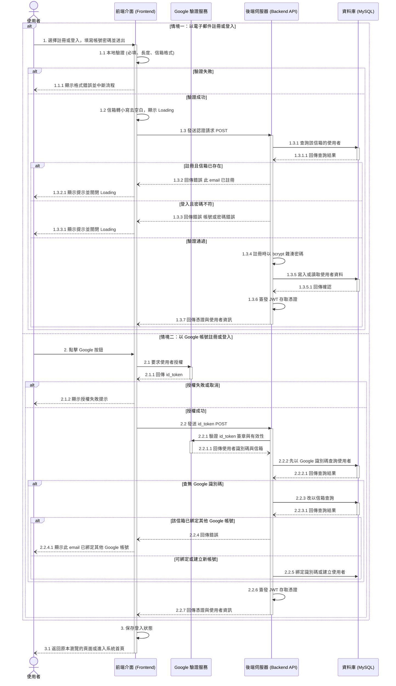
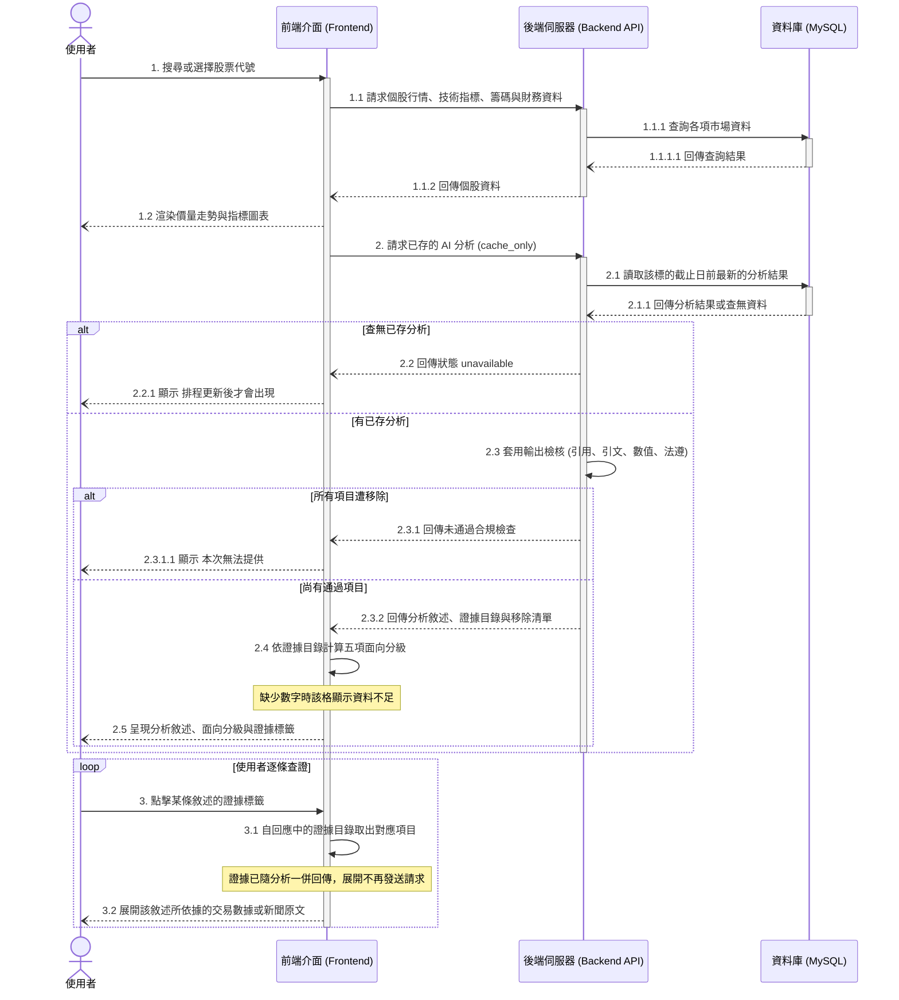
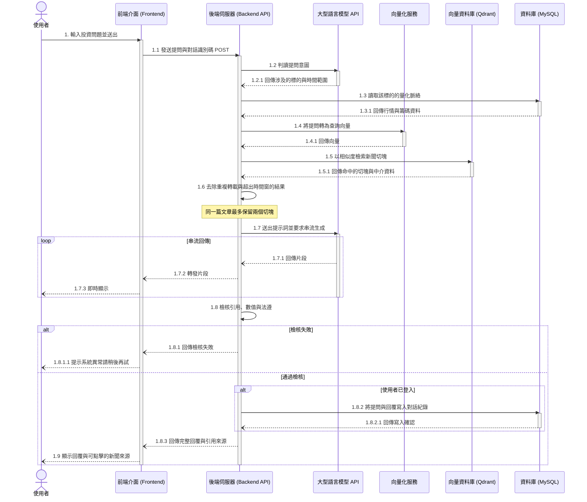
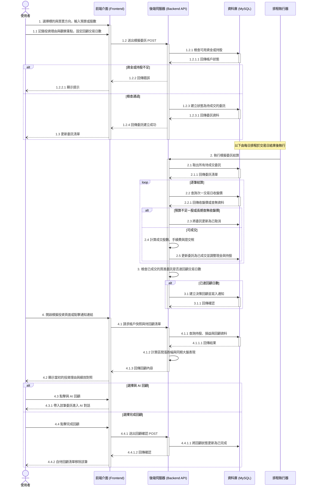
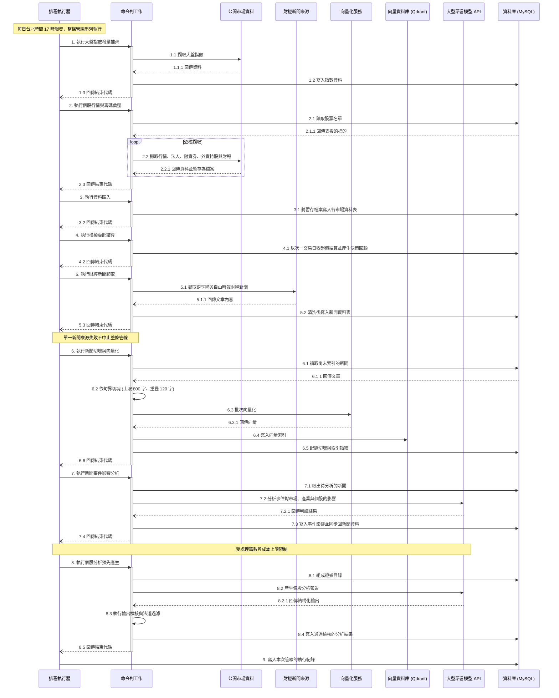
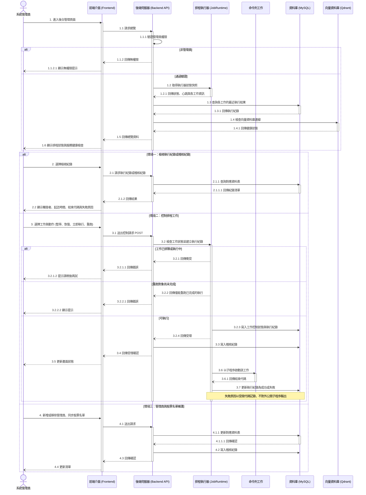

#會員註冊與登入

```mermaid
sequenceDiagram
    actor User as 使用者
    participant FE as 前端介面 (Frontend)
    participant Google as Google 驗證服務
    participant API as 後端伺服器 (Backend API)
    participant DB as 資料庫 (MySQL)

    alt 情境一：以電子郵件註冊或登入
        User->>FE: 1. 選擇註冊或登入，填寫帳號密碼並送出
        activate FE
        FE->>FE: 1.1 本地驗證 (必填、長度、信箱格式)
        alt 驗證失敗
            FE--)User: 1.1.1 顯示格式錯誤並中斷流程
        else 驗證成功
            FE->>FE: 1.2 信箱轉小寫去空白，顯示 Loading
            FE->>API: 1.3 發送認證請求 POST
            activate API
            API->>DB: 1.3.1 查詢該信箱的使用者
            activate DB
            DB--)API: 1.3.1.1 回傳查詢結果
            deactivate DB
            alt 註冊且信箱已存在
                API--)FE: 1.3.2 回傳錯誤 此 email 已註冊
                FE--)User: 1.3.2.1 顯示提示並關閉 Loading
            else 登入且密碼不符
                API--)FE: 1.3.3 回傳錯誤 帳號或密碼錯誤
                FE--)User: 1.3.3.1 顯示提示並關閉 Loading
            else 驗證通過
                API->>API: 1.3.4 註冊時以 bcrypt 雜湊密碼
                API->>DB: 1.3.5 寫入或讀取使用者資料
                activate DB
                DB--)API: 1.3.5.1 回傳確認
                deactivate DB
                API->>API: 1.3.6 簽發 JWT 存取憑證
                API--)FE: 1.3.7 回傳憑證與使用者資訊
                deactivate API
            end
        end
    else 情境二：以 Google 帳號註冊或登入
        User->>FE: 2. 點擊 Google 按鈕
        FE->>Google: 2.1 要求使用者授權
        activate Google
        Google--)FE: 2.1.1 回傳 id_token
        deactivate Google
        alt 授權失敗或取消
            FE--)User: 2.1.2 顯示授權失敗提示
        else 授權成功
            FE->>API: 2.2 發送 id_token POST
            activate API
            API->>Google: 2.2.1 驗證 id_token 簽章與有效性
            activate Google
            Google--)API: 2.2.1.1 回傳使用者識別碼與信箱
            deactivate Google
            API->>DB: 2.2.2 先以 Google 識別碼查詢使用者
            activate DB
            DB--)API: 2.2.2.1 回傳查詢結果
            deactivate DB
            alt 查無 Google 識別碼
                API->>DB: 2.2.3 改以信箱查詢
                activate DB
                DB--)API: 2.2.3.1 回傳查詢結果
                deactivate DB
                alt 該信箱已綁定其他 Google 帳號
                    API--)FE: 2.2.4 回傳錯誤
                    FE--)User: 2.2.4.1 顯示此 email 已綁定其他 Google 帳號
                else 可綁定或建立新帳號
                    API->>DB: 2.2.5 綁定識別碼或建立使用者
                end
            end
            API->>API: 2.2.6 簽發 JWT 存取憑證
            API--)FE: 2.2.7 回傳憑證與使用者資訊
            deactivate API
        end
    end

    FE->>FE: 3. 保存登入狀態
    FE--)User: 3.1 返回原本瀏覽的頁面或進入系統首頁
    deactivate FE
```
#個股分析與證據溯源

```mermaid
sequenceDiagram
    actor User as 使用者
    participant FE as 前端介面 (Frontend)
    participant API as 後端伺服器 (Backend API)
    participant DB as 資料庫 (MySQL)

    User->>FE: 1. 搜尋或選擇股票代號
    activate FE
    FE->>API: 1.1 請求個股行情、技術指標、籌碼與財務資料
    activate API
    API->>DB: 1.1.1 查詢各項市場資料
    activate DB
    DB--)API: 1.1.1.1 回傳查詢結果
    deactivate DB
    API--)FE: 1.1.2 回傳個股資料
    deactivate API
    FE--)User: 1.2 渲染價量走勢與指標圖表

    FE->>API: 2. 請求已存的 AI 分析 (cache_only)
    activate API
    API->>DB: 2.1 讀取該標的截止日前最新的分析結果
    activate DB
    DB--)API: 2.1.1 回傳分析結果或查無資料
    deactivate DB

    alt 查無已存分析
        API--)FE: 2.2 回傳狀態 unavailable
        FE--)User: 2.2.1 顯示 排程更新後才會出現
    else 有已存分析
        API->>API: 2.3 套用輸出檢核 (引用、引文、數值、法遵)
        alt 所有項目遭移除
            API--)FE: 2.3.1 回傳未通過合規檢查
            FE--)User: 2.3.1.1 顯示 本次無法提供
        else 尚有通過項目
            API--)FE: 2.3.2 回傳分析敘述、證據目錄與移除清單
            FE->>FE: 2.4 依證據目錄計算五項面向分級
            Note over FE: 缺少數字時該格顯示資料不足
            FE--)User: 2.5 呈現分析敘述、面向分級與證據標籤
        end
    end
    deactivate API

    loop 使用者逐條查證
        User->>FE: 3. 點擊某條敘述的證據標籤
        FE->>FE: 3.1 自回應中的證據目錄取出對應項目
        Note over FE: 證據已隨分析一併回傳，展開不再發送請求
        FE--)User: 3.2 展開該敘述所依據的交易數據或新聞原文
    end
    deactivate FE
```
#AI對話

```mermaid
sequenceDiagram
    actor User as 使用者
    participant FE as 前端介面 (Frontend)
    participant API as 後端伺服器 (Backend API)
    participant LLM as 大型語言模型 API
    participant Embed as 向量化服務
    participant VDB as 向量資料庫 (Qdrant)
    participant DB as 資料庫 (MySQL)

    User->>FE: 1. 輸入投資問題並送出
    activate FE
    FE->>API: 1.1 發送提問與對話識別碼 POST
    activate API

    API->>LLM: 1.2 判讀提問意圖
    activate LLM
    LLM--)API: 1.2.1 回傳涉及的標的與時間範圍
    deactivate LLM

    API->>DB: 1.3 讀取該標的的量化脈絡
    activate DB
    DB--)API: 1.3.1 回傳行情與籌碼資料
    deactivate DB

    API->>Embed: 1.4 將提問轉為查詢向量
    activate Embed
    Embed--)API: 1.4.1 回傳向量
    deactivate Embed

    API->>VDB: 1.5 以相似度檢索新聞切塊
    activate VDB
    VDB--)API: 1.5.1 回傳命中的切塊與中介資料
    deactivate VDB

    API->>API: 1.6 去除重複轉載與超出時間窗的結果
    Note over API: 同一篇文章最多保留兩個切塊

    API->>LLM: 1.7 送出提示詞並要求串流生成
    activate LLM
    loop 串流回傳
        LLM--)API: 1.7.1 回傳片段
        API--)FE: 1.7.2 轉發片段
        FE--)User: 1.7.3 即時顯示
    end
    deactivate LLM

    API->>API: 1.8 檢核引用、數值與法遵
    alt 檢核失敗
        API--)FE: 1.8.1 回傳檢核失敗
        FE--)User: 1.8.1.1 提示系統異常請稍後再試
    else 通過檢核
        alt 使用者已登入
            API->>DB: 1.8.2 將提問與回覆寫入對話紀錄
            activate DB
            DB--)API: 1.8.2.1 回傳寫入確認
            deactivate DB
        end
        API--)FE: 1.8.3 回傳完整回覆與引用來源
        FE--)User: 1.9 顯示回覆與可點擊的新聞來源
    end
    deactivate API
    deactivate FE
```

#模擬投資與決策回顧

```mermaid
sequenceDiagram
    actor User as 使用者
    participant FE as 前端介面 (Frontend)
    participant API as 後端伺服器 (Backend API)
    participant DB as 資料庫 (MySQL)
    participant Sched as 排程執行器

    User->>FE: 1. 選擇標的與買賣方向，輸入預算或股數
    activate FE
    User->>FE: 1.1 記錄投資理由與觀察重點，設定回顧交易日數
    FE->>API: 1.2 送出模擬委託 POST
    activate API
    API->>DB: 1.2.1 檢查可用資金或持股
    activate DB
    DB--)API: 1.2.1.1 回傳帳戶狀態
    deactivate DB
    alt 資金或持股不足
        API--)FE: 1.2.2 回傳錯誤
        FE--)User: 1.2.2.1 顯示提示
    else 檢查通過
        API->>DB: 1.2.3 建立狀態為待成交的委託
        activate DB
        DB--)API: 1.2.3.1 回傳委託資料
        deactivate DB
        API--)FE: 1.2.4 回傳委託建立成功
        FE--)User: 1.3 更新委託清單
    end
    deactivate API
    deactivate FE

    Note over Sched,DB: 以下由每日排程於交易日結束後執行

    Sched->>API: 2. 執行模擬委託結算
    activate API
    API->>DB: 2.1 取出所有待成交委託
    activate DB
    DB--)API: 2.1.1 回傳委託清單
    deactivate DB

    loop 逐筆結算
        API->>DB: 2.2 查詢次一交易日收盤價
        activate DB
        DB--)API: 2.2.1 回傳收盤價或查無資料
        deactivate DB
        alt 預算不足一股或長期查無收盤價
            API->>DB: 2.3 將委託更新為已取消
        else 可成交
            API->>API: 2.4 計算成交股數、手續費與證交稅
            API->>DB: 2.5 更新委託為已成交並調整現金與持股
        end
    end

    API->>API: 3. 檢查已成交的買進委託是否達回顧交易日數
    alt 已達回顧日數
        API->>DB: 3.1 建立決策回顧並寫入通知
        activate DB
        DB--)API: 3.1.1 回傳確認
        deactivate DB
    end
    deactivate API

    User->>FE: 4. 開啟模擬投資頁面或點擊通知連結
    activate FE
    FE->>API: 4.1 請求帳戶快照與待回顧清單
    activate API
    API->>DB: 4.1.1 查詢持股、損益與回顧資料
    activate DB
    DB--)API: 4.1.1.1 回傳結果
    deactivate DB
    API->>API: 4.1.2 計算區間漲跌幅與同期大盤表現
    API--)FE: 4.1.3 回傳回顧內容
    deactivate API
    FE--)User: 4.2 顯示當初的投資理由與績效對照

    alt 選擇與 AI 回顧
        User->>FE: 4.3 點擊與 AI 回顧
        FE--)User: 4.3.1 帶入該筆委託進入 AI 對話
    else 選擇完成回顧
        User->>FE: 4.4 點擊完成回顧
        FE->>API: 4.4.1 送出回顧確認 POST
        activate API
        API->>DB: 4.4.1.1 將回顧狀態更新為已完成
        API--)FE: 4.4.1.2 回傳確認
        deactivate API
        FE--)User: 4.4.2 自待回顧清單移除該筆
    end
    deactivate FE
```
#每日資料管線

```mermaid
sequenceDiagram
    participant Sched as 排程執行器
    participant Job as 命令列工作
    participant Market as 公開市場資料
    participant News as 財經新聞來源
    participant Embed as 向量化服務
    participant VDB as 向量資料庫 (Qdrant)
    participant LLM as 大型語言模型 API
    participant DB as 資料庫 (MySQL)

    Note over Sched: 每日台北時間 17 時觸發，整條管線串列執行

    Sched->>Job: 1. 執行大盤指數增量補齊
    activate Job
    Job->>Market: 1.1 擷取大盤指數
    Market--)Job: 1.1.1 回傳資料
    Job->>DB: 1.2 寫入指數資料
    Job--)Sched: 1.3 回傳結束代碼
    deactivate Job

    Sched->>Job: 2. 執行個股行情與籌碼彙整
    activate Job
    Job->>DB: 2.1 讀取股票名單
    DB--)Job: 2.1.1 回傳支援的標的
    loop 逐檔擷取
        Job->>Market: 2.2 擷取行情、法人、融資券、外資持股與財報
        Market--)Job: 2.2.1 回傳資料並暫存為檔案
    end
    Job--)Sched: 2.3 回傳結束代碼
    deactivate Job

    Sched->>Job: 3. 執行資料匯入
    activate Job
    Job->>DB: 3.1 將暫存檔案寫入各市場資料表
    Job--)Sched: 3.2 回傳結束代碼
    deactivate Job

    Sched->>Job: 4. 執行模擬委託結算
    activate Job
    Job->>DB: 4.1 以次一交易日收盤價結算並產生決策回顧
    Job--)Sched: 4.2 回傳結束代碼
    deactivate Job

    Sched->>Job: 5. 執行財經新聞爬取
    activate Job
    Job->>News: 5.1 擷取鉅亨網與自由時報財經新聞
    News--)Job: 5.1.1 回傳文章內容
    Job->>DB: 5.2 清洗後寫入新聞資料表
    Job--)Sched: 5.3 回傳結束代碼
    Note over Sched,Job: 單一新聞來源失敗不中止整條管線
    deactivate Job

    Sched->>Job: 6. 執行新聞切塊與向量化
    activate Job
    Job->>DB: 6.1 讀取尚未索引的新聞
    DB--)Job: 6.1.1 回傳文章
    Job->>Job: 6.2 依句界切塊 (上限 800 字、重疊 120 字)
    Job->>Embed: 6.3 批次向量化
    Embed--)Job: 6.3.1 回傳向量
    Job->>VDB: 6.4 寫入向量索引
    Job->>DB: 6.5 記錄切塊與索引指紋
    Job--)Sched: 6.6 回傳結束代碼
    deactivate Job

    Sched->>Job: 7. 執行新聞事件影響分析
    activate Job
    Job->>DB: 7.1 取出待分析的新聞
    Job->>LLM: 7.2 分析事件對市場、產業與個股的影響
    LLM--)Job: 7.2.1 回傳判讀結果
    Job->>DB: 7.3 寫入事件影響並同步回新聞資料
    Job--)Sched: 7.4 回傳結束代碼
    Note over Sched,LLM: 受處理篇數與成本上限限制
    deactivate Job

    Sched->>Job: 8. 執行個股分析預先產生
    activate Job
    Job->>DB: 8.1 組成證據目錄
    Job->>LLM: 8.2 產生個股分析報告
    LLM--)Job: 8.2.1 回傳結構化輸出
    Job->>Job: 8.3 執行輸出檢核與法遵過濾
    Job->>DB: 8.4 寫入通過檢核的分析結果
    Job--)Sched: 8.5 回傳結束代碼
    deactivate Job

    Sched->>DB: 9. 寫入本次管線的執行紀錄
```
#後台管理

```mermaid
sequenceDiagram
    actor Admin as 系統管理員
    participant FE as 前端介面 (Frontend)
    participant API as 後端伺服器 (Backend API)
    participant RT as 排程執行器 (JobRuntime)
    participant Job as 命令列工作
    participant DB as 資料庫 (MySQL)
    participant VDB as 向量資料庫 (Qdrant)

    Admin->>FE: 1. 進入後台管理頁面
    activate FE
    FE->>API: 1.1 請求總覽
    activate API
    API->>API: 1.1.1 驗證管理員權限
    alt 非管理員
        API--)FE: 1.1.2 回傳無權限
        FE--)Admin: 1.1.2.1 顯示無權限提示
    else 通過驗證
        API->>RT: 1.2 取得執行器狀態快照
        activate RT
        RT--)API: 1.2.1 回傳狀態、心跳與各工作資訊
        deactivate RT
        API->>DB: 1.3 查詢各工作的最近執行結果
        activate DB
        DB--)API: 1.3.1 回傳執行紀錄
        deactivate DB
        API->>VDB: 1.4 檢查向量資料庫連線
        activate VDB
        VDB--)API: 1.4.1 回傳健康狀態
        deactivate VDB
        API--)FE: 1.5 回傳總覽資料
        FE--)Admin: 1.6 顯示排程狀態與服務健康檢查
    end
    deactivate API

    alt 情境一：檢視執行紀錄或稽核紀錄
        Admin->>FE: 2. 選擇檢視紀錄
        FE->>API: 2.1 請求執行紀錄或稽核紀錄
        activate API
        API->>DB: 2.1.1 查詢對應資料表
        activate DB
        DB--)API: 2.1.1.1 回傳紀錄清單
        deactivate DB
        API--)FE: 2.1.2 回傳結果
        deactivate API
        FE--)Admin: 2.2 顯示觸發者、起迄時間、結束代碼與失敗原因
    else 情境二：控制排程工作
        Admin->>FE: 3. 選擇工作與動作 (暫停、恢復、立即執行、重跑)
        FE->>API: 3.1 送出控制請求 POST
        activate API
        API->>RT: 3.2 檢查工作狀態並建立執行紀錄
        activate RT
        alt 工作已排隊或執行中
            RT--)API: 3.2.1 回傳衝突
            API--)FE: 3.2.1.1 回傳錯誤
            FE--)Admin: 3.2.1.2 提示請稍後再試
        else 重跑對象尚未完成
            RT--)API: 3.2.2 回傳僅能重跑已完成的執行
            API--)FE: 3.2.2.1 回傳錯誤
            FE--)Admin: 3.2.2.2 顯示提示
        else 可執行
            RT->>DB: 3.2.3 寫入工作控制狀態與執行紀錄
            RT--)API: 3.2.4 回傳受理
            API->>DB: 3.3 寫入稽核紀錄
            API--)FE: 3.4 回傳受理確認
            FE--)Admin: 3.5 更新畫面狀態
            RT->>Job: 3.6 以子程序啟動該工作
            activate Job
            Job--)RT: 3.6.1 回傳結束代碼
            deactivate Job
            RT->>DB: 3.7 更新執行紀錄為成功或失敗
            Note over RT,DB: 失敗原因以受限代碼記錄，不對外公開子程序輸出
        end
        deactivate RT
        deactivate API
    else 情境三：管理員與股票名單維護
        Admin->>FE: 4. 新增或移除管理員、同步股票名單
        FE->>API: 4.1 送出請求
        activate API
        API->>DB: 4.1.1 更新對應資料表
        activate DB
        DB--)API: 4.1.1.1 回傳確認
        deactivate DB
        API->>DB: 4.2 寫入稽核紀錄
        API--)FE: 4.3 回傳確認
        deactivate API
        FE--)Admin: 4.4 更新清單
    end
    deactivate FE
```