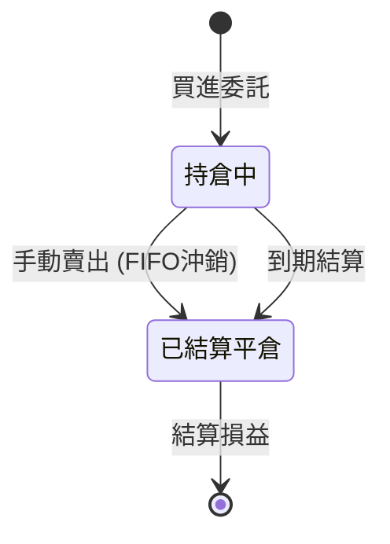

```mermaid
stateDiagram-v2
    %% 定義節點代號與中文標籤
    state "持倉中" as Holding
    state "已結算平倉" as Settled
    
    [*] --> Holding : 買進委託
    
    Holding --> Settled : 手動賣出 (FIFO沖銷)
    Holding --> Settled : 到期結算
    
    Settled --> [*] : 結算損益
```
