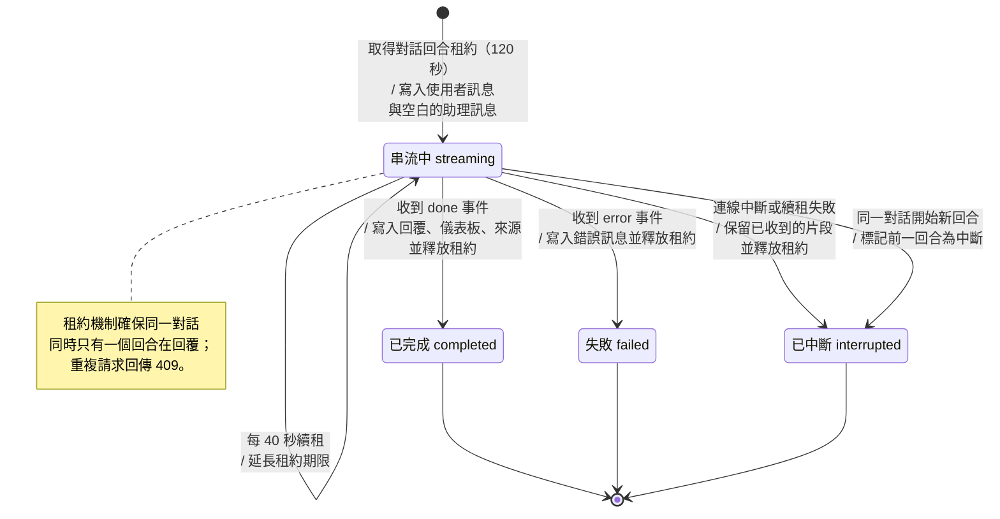

```mermaid
stateDiagram-v2
    direction TB

    state "串流中 streaming" as STREAMING
    state "已完成 completed" as COMPLETED
    state "失敗 failed" as FAILED
    state "已中斷 interrupted" as INTERRUPTED

    [*] --> STREAMING : 取得對話回合租約（120 秒）<br/>/ 寫入使用者訊息<br/>與空白的助理訊息

    STREAMING --> STREAMING : 每 40 秒續租<br/>/ 延長租約期限

    STREAMING --> COMPLETED : 收到 done 事件<br/>/ 寫入回覆、儀表板、來源<br/>並釋放租約
    STREAMING --> FAILED : 收到 error 事件<br/>/ 寫入錯誤訊息並釋放租約
    STREAMING --> INTERRUPTED : 連線中斷或續租失敗<br/>/ 保留已收到的片段<br/>並釋放租約
    STREAMING --> INTERRUPTED : 同一對話開始新回合<br/>/ 標記前一回合為中斷

    COMPLETED --> [*]
    FAILED --> [*]
    INTERRUPTED --> [*]

    note right of STREAMING
      租約機制確保同一對話
      同時只有一個回合在回覆；
      重複請求回傳 409。
    end note
```
