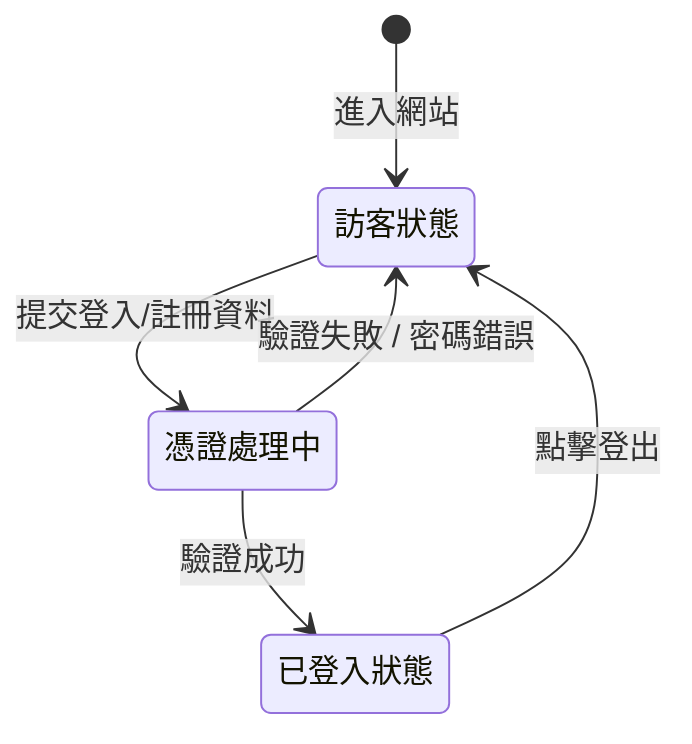

```mermaid
stateDiagram-v2
    %% 定義節點代號與中文標籤
    state "訪客狀態" as Guest
    state "憑證處理中" as Processing
    state "已登入狀態" as LoggedIn
    
    %% 初始狀態
    [*] --> Guest : 進入網站
    
    %% 驗證流程 (動作在箭頭上，狀態在方塊裡)
    Guest --> Processing : 提交登入/註冊資料
    Processing --> Guest : 驗證失敗 / 密碼錯誤
    Processing --> LoggedIn : 驗證成功
    
    %% 登出
    LoggedIn --> Guest : 點擊登出
```
