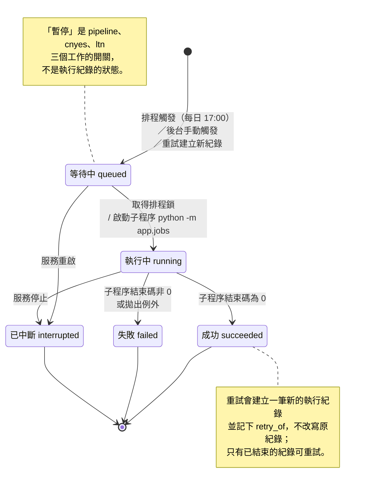

```mermaid
stateDiagram-v2
    direction TB

    state "等待中 queued" as QUEUED
    state "執行中 running" as RUNNING
    state "成功 succeeded" as SUCCEEDED
    state "失敗 failed" as FAILED
    state "已中斷 interrupted" as INTERRUPTED

    [*] --> QUEUED : 排程觸發（每日 17:00）<br/>／後台手動觸發<br/>／重試建立新紀錄

    QUEUED --> RUNNING : 取得排程鎖<br/>/ 啟動子程序 python -m app.jobs
    QUEUED --> INTERRUPTED : 服務重啟

    RUNNING --> SUCCEEDED : 子程序結束碼為 0
    RUNNING --> FAILED : 子程序結束碼非 0<br/>或拋出例外
    RUNNING --> INTERRUPTED : 服務停止

    SUCCEEDED --> [*]
    FAILED --> [*]
    INTERRUPTED --> [*]

    note right of SUCCEEDED
      重試會建立一筆新的執行紀錄
      並記下 retry_of，不改寫原紀錄；
      只有已結束的紀錄可重試。
    end note

    note left of QUEUED
      「暫停」是 pipeline、cnyes、ltn
      三個工作的開關，
      不是執行紀錄的狀態。
    end note
```
