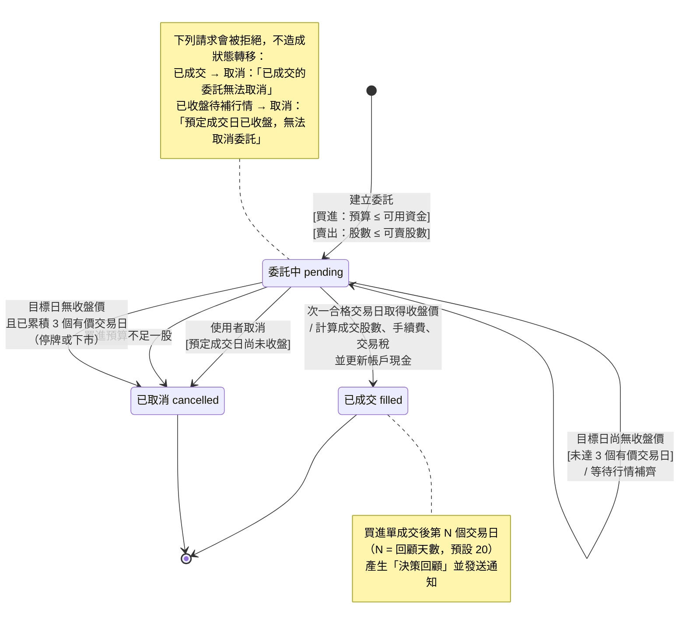
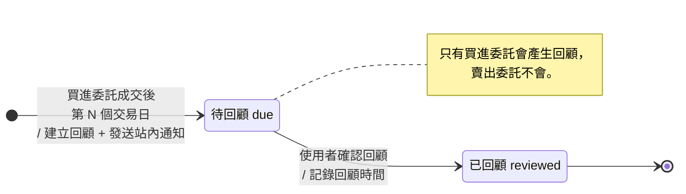

```mermaid
stateDiagram-v2
    direction TB

    state "委託中 pending" as PENDING
    state "已成交 filled" as FILLED
    state "已取消 cancelled" as CANCELLED

    [*] --> PENDING : 建立委託<br/>[買進：預算 ≤ 可用資金]<br/>[賣出：股數 ≤ 可賣股數]

    PENDING --> PENDING : 目標日尚無收盤價<br/>[未達 3 個有價交易日]<br/>/ 等待行情補齊

    PENDING --> FILLED : 次一合格交易日取得收盤價<br/>/ 計算成交股數、手續費、交易稅<br/>並更新帳戶現金

    PENDING --> CANCELLED : 使用者取消<br/>[預定成交日尚未收盤]
    PENDING --> CANCELLED : 買進預算不足一股
    PENDING --> CANCELLED : 目標日無收盤價<br/>且已累積 3 個有價交易日<br/>（停牌或下市）

    FILLED --> [*]
    CANCELLED --> [*]

    note right of FILLED
      買進單成交後第 N 個交易日
      （N = 回顧天數，預設 20）
      產生「決策回顧」並發送通知
    end note

    note left of PENDING
      下列請求會被拒絕，不造成狀態轉移：
      已成交 → 取消：「已成交的委託無法取消」
      已收盤待補行情 → 取消：
      「預定成交日已收盤，無法取消委託」
    end note
```

```mermaid
stateDiagram-v2
    direction LR

    state "待回顧 due" as DUE
    state "已回顧 reviewed" as REVIEWED

    [*] --> DUE : 買進委託成交後<br/>第 N 個交易日<br/>/ 建立回顧 + 發送站內通知

    DUE --> REVIEWED : 使用者確認回顧<br/>/ 記錄回顧時間

    REVIEWED --> [*]

    note right of DUE
      只有買進委託會產生回顧，
      賣出委託不會。
    end note
```