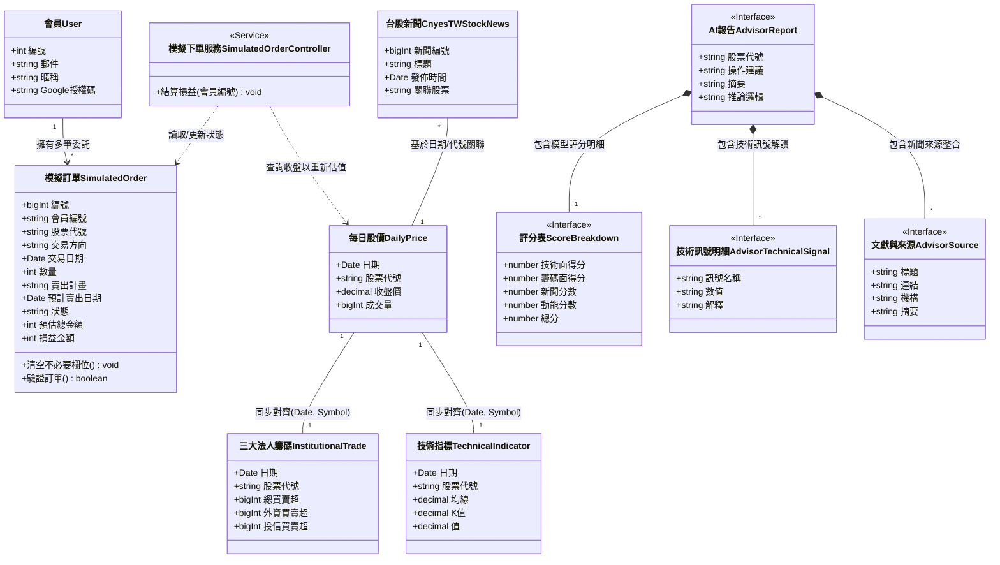

```mermaid
classDiagram
    %% ==========================================
    %% 模組 1：會員與下單業務 (User & Order)
    %% ==========================================
    
    class 會員User {
        +int 編號
        +string 郵件
        +string 暱稱
        +string Google授權碼
    }
    
    class 模擬訂單SimulatedOrder {
        +bigInt 編號
        +string 會員編號
        +string 股票代號
        +string 交易方向
        +Date 交易日期
        +int 數量
        +string 賣出計畫
        +Date 預計賣出日期
        +string 狀態
        +int 預估總金額
        +int 損益金額
        +清空不必要欄位() void
        +驗證訂單() boolean
    }
    
    class 模擬下單服務SimulatedOrderController {
        <<Service>>
        +結算損益(會員編號) void
    }

    %% ==========================================
    %% 模組 2：市場大數據實體 (Market Data)
    %% ==========================================
    
    class 每日股價DailyPrice {
        +Date 日期
        +string 股票代號
        +decimal 收盤價
        +bigInt 成交量
    }
    
    class 三大法人籌碼InstitutionalTrade {
        +Date 日期
        +string 股票代號
        +bigInt 總買賣超
        +bigInt 外資買賣超
        +bigInt 投信買賣超
    }
    
    class 技術指標TechnicalIndicator {
        +Date 日期
        +string 股票代號
        +decimal 均線
        +decimal K值
        +decimal 值
    }

    class 台股新聞CnyesTWStockNews {
        +bigInt 新聞編號
        +string 標題
        +Date 發佈時間
        +string 關聯股票
    }

    %% ==========================================
    %% 模組 3：AI 報告分析 (Advisor)
    %% ==========================================
    
    class AI報告AdvisorReport {
        <<Interface>>
        +string 股票代號
        +string 操作建議
        +string 摘要
        +string 推論邏輯
    }
    
    class 評分表ScoreBreakdown {
        <<Interface>>
        +number 技術面得分
        +number 籌碼面得分
        +number 新聞分數
        +number 動能分數
        +number 總分
    }
    
    class 技術訊號明細AdvisorTechnicalSignal {
        <<Interface>>
        +string 訊號名稱
        +string 數值
        +string 解釋
    }
    
    class 文獻與來源AdvisorSource {
        <<Interface>>
        +string 標題
        +string 連結
        +string 機構
        +string 摘要
    }

    %% ==========================================
    %% 實體關聯 (Relationships)
    %% ==========================================
    
    會員User "1" --> "*" 模擬訂單SimulatedOrder : 擁有多筆委託
    
    模擬下單服務SimulatedOrderController ..> 模擬訂單SimulatedOrder : 讀取/更新狀態
    模擬下單服務SimulatedOrderController ..> 每日股價DailyPrice : 查詢收盤以重新估值
    
    每日股價DailyPrice "1" -- "1" 三大法人籌碼InstitutionalTrade : 同步對齊(Date, Symbol)
    每日股價DailyPrice "1" -- "1" 技術指標TechnicalIndicator : 同步對齊(Date, Symbol)
    台股新聞CnyesTWStockNews "*" -- "1" 每日股價DailyPrice : 基於日期/代號關聯
    
    AI報告AdvisorReport *-- "1" 評分表ScoreBreakdown : 包含模型評分明細
    AI報告AdvisorReport *-- "*" 技術訊號明細AdvisorTechnicalSignal : 包含技術訊號解讀
    AI報告AdvisorReport *-- "*" 文獻與來源AdvisorSource : 包含新聞來源整合
```