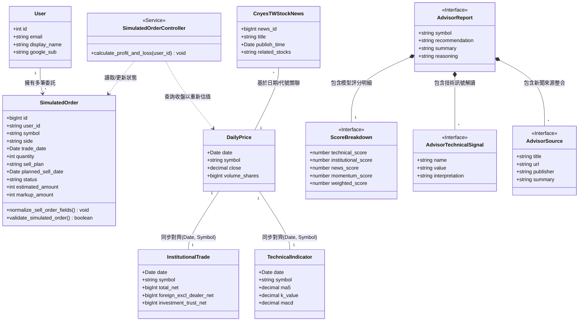

```mermaid
classDiagram
    %% ==========================================
    %% 模組 1：使用者與下單業務 (User & Order)
    %% ==========================================
    
    %% 會員模型
    class User {
        %% 使用者的唯一識別碼 (Primary Key)
        +int id
        %% 使用者的電子信箱，作為登入帳號
        +string email
        %% 使用者在系統介面上顯示的暱稱
        +string display_name
        %% 綁定 Google 第三方登入用的唯一授權碼
        +string google_sub
    }
    
    %% 模擬訂單資料表
    class SimulatedOrder {
        %% 委託單的唯一編號 (Primary Key)
        +bigInt id
        %% 關聯到下單使用者的唯一識別碼 (Foreign Key)
        +string user_id
        %% 買賣的股票代號 (例如：2330)
        +string symbol
        %% 交易方向，通常為買進 (buy) 或賣出 (sell)
        +string side
        %% 模擬下單的交易日期
        +Date trade_date
        %% 委託的數量 (通常以「張」為單位)
        +int quantity
        %% 賣出策略計畫 (例如：長期持有、指定日期)
        +string sell_plan
        %% 若設定依日期賣出，此為預計執行賣出的日期
        +Date planned_sell_date
        %% 委託單目前的狀態 (例如：待處理 pending、已成交 filled)
        +string status
        %% 委託當時預估的總金額成本
        +int estimated_amount
        %% 系統結算出來的未實現或已實現損益金額
        +int markup_amount
        %% 資料清理方法：若為賣單，自動清空不必要的賣出計畫欄位
        +normalize_sell_order_fields() void
        %% 驗證方法：檢查下單日期是否合理、張數是否大於零
        +validate_simulated_order() boolean
    }
    
    %% 負責處理模擬下單業務邏輯的後端服務
    class SimulatedOrderController {
        <<Service>>
        %% 核心商業邏輯方法：根據最新股價結算特定使用者的整體資產損益
        +calculate_profit_and_loss(user_id) void
    }

    %% ==========================================
    %% 模組 2：市場大數據實體 (Market Data)
    %% ==========================================
    
    %% 每日股價，記錄市場個股的日K線歷史資料
    class DailyPrice {
        %% 交易日期 (複合主鍵之一)
        +Date date
        %% 股票代號 (複合主鍵之一)
        +string symbol
        %% 當日收盤價
        +decimal close
        %% 當日總成交股數 (成交量)
        +bigInt volume_shares
    }
    
    %% 三大法人籌碼，記錄三大法人的每日進出狀況
    class InstitutionalTrade {
        %% 交易日期 (複合主鍵之一)
        +Date date
        %% 股票代號 (複合主鍵之一)
        +string symbol
        %% 三大法人買賣超總計 (股/張數)
        +bigInt total_net
        %% 外資(不含外資自營商)買賣超 (股/張數)
        +bigInt foreign_excl_dealer_net
        %% 投信買賣超 (股/張數)
        +bigInt investment_trust_net
    }
    
    %% 技術指標，存放經過系統計算後的各項技術分析數值
    class TechnicalIndicator {
        %% 交易日期 (複合主鍵之一)
        +Date date
        %% 股票代號 (複合主鍵之一)
        +string symbol
        %% 5 日移動平均線 (MA5) 的價格
        +decimal ma5
        %% KD 指標中的 K 值
        +decimal k_value
        %% MACD 指標的柱狀體或差離值
        +decimal macd
    }

    %% 相關新聞來源，記錄從外部來源爬取下來的台股新聞
    class CnyesTWStockNews {
        %% 新聞的唯一系統識別碼 (Primary Key)
        +bigInt news_id
        %% 新聞的標題文字
        +string title
        %% 新聞實際發布的時間戳記
        +Date publish_time
        %% 這則新聞關聯到的股票代號 (可能有多檔)
        +string related_stocks
    }

    %% ==========================================
    %% 模組 3：AI 報告分析 (Advisor)
    %% ==========================================
    
    %% AI 投資顧問生成的最終報告介面 (前端/API 回傳格式)
    class AdvisorReport {
        <<Interface>>
        %% 報告分析的目標股票代號
        +string symbol
        %% AI 給出的最終操作建議 (例如：buy, sell, wait)
        +string recommendation
        %% 整份分析報告的核心摘要文字
        +string summary
        %% AI 產出這個建議背後的詳細邏輯與推論過程
        +string reasoning
    }
    
    %% 評分表介面，呈現多維度的量化分數
    class ScoreBreakdown {
        <<Interface>>
        %% 技術面分析的得分
        +number technical_score
        %% 籌碼面分析的得分
        +number institutional_score
        %% 新聞情緒面分析的得分
        +number news_score
        %% 市場動能分析的得分
        +number momentum_score
        %% 各項指標依照權重計算後的系統總分
        +number weighted_score
    }
    
    %% 技術訊號明細
    class AdvisorTechnicalSignal {
        <<Interface>>
        %% 觀測到的技術訊號名稱 (例如：MACD、RSI)
        +string name
        %% 該訊號的具體數值或觸發狀態 (例如：黃金交叉、數值 15)
        +string value
        %% AI 對於這個訊號的金融多空意義解釋
        +string interpretation
    }
    
    %% 文獻與新聞來源明細
    class AdvisorSource {
        <<Interface>>
        %% 引用的新聞或資料標題
        +string title
        %% 可以點擊查證的外部原始連結 (URL)
        +string url
        %% 發布該新聞或資料的機構名稱 (例如：鉅亨網)
        +string publisher
        %% 擷取出來供 LLM 分析的內文摘要段落
        +string summary
    }

    %% ==========================================
    %% 實體關聯 (Relationships)
    %% ==========================================
    
    %% 1. 使用者與下單關係 (1對多)
    User "1" --> "*" SimulatedOrder : 擁有多筆委託
    
    %% 2. 核心邏輯層依賴關係
    SimulatedOrderController ..> SimulatedOrder : 讀取/更新狀態
    SimulatedOrderController ..> DailyPrice : 查詢收盤以重新估值
    
    %% 3. 市場大數據的平行對應關係 (1對1共享 Date & Symbol)
    DailyPrice "1" -- "1" InstitutionalTrade : 同步對齊(Date, Symbol)
    DailyPrice "1" -- "1" TechnicalIndicator : 同步對齊(Date, Symbol)
    CnyesTWStockNews "*" -- "1" DailyPrice : 基於日期/代號關聯
    
    %% 4. AI 報告組合關係 (Composition)
    AdvisorReport *-- "1" ScoreBreakdown : 包含模型評分明細
    AdvisorReport *-- "*" AdvisorTechnicalSignal : 包含技術訊號解讀
    AdvisorReport *-- "*" AdvisorSource : 包含新聞來源整合
```