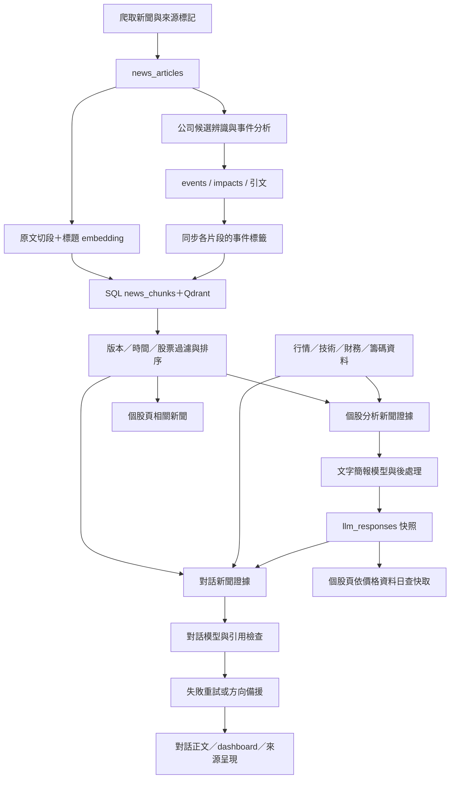

# AI 對話、個股分析、新聞事件與向量檢索審查

審查日期：2026-09-27（台灣時間）  
程式版本：`570d444e07a98819c048b82b2f44d609278fd553`  
範圍：目前的 `backend/app/` 與 `frontend/Topic/`，以及正式環境既有資料的唯讀抽查。此次未修改產品程式碼、未執行資料遷移或 worker、未呼叫 LLM 或 embedding 服務。

## 一、整體判斷

**這套系統已有可用的資料整理與證據追溯基礎，但目前還不足以讓使用者放心依賴它的多空結論。** 最需要先修的問題集中在資料時間、快照選擇、公司對應與失敗後的回答邏輯。更換模型或增加新聞數量，無法直接修好這些問題。

本次最重要的發現如下：

1. **目前個股頁的快取查詢邏輯會選到含模擬新聞的南亞科分析。** 該分析把明確標為「非真實新聞」的測試情境寫成系統性風險，正文沒有保留模擬標示。這是已儲存資料與實際選取規則的重現，不只是刻意製造的模型反例。
2. **月營收的資料月份與可用日期存在契約錯誤。** 9 月才出表的 8 月完整營收，會在 8 月 10 日的歷史分析中被認為已公布。這會污染歷史解讀與依賴同一資料組裝器的對話基本面。
3. **AI 對話的方向備援會自行製造不受證據支持的結論。** 新聞從接單成長改成停工、取消財測，備援答案仍逐字相同；多股查詢還可能把鴻海價格寫成台積電價格。
4. **引用、JSON 與原文引句的檢查確實有作用，但尚未驗證主張本身。** 正負號錯誤、無來源數字、預測被標為事實，以及投資人獲利被當成公司正向影響，都可能通過目前檢查。
5. **向量化有實際用途，也會放大上游偏差。** 它決定模型看見哪些新聞片段；公司候選漏抓、片段選擇、事件標籤與快照失效規則，都會改變最後答案。現有證據不足以宣稱「使用向量後，整體答案比較準」。

### 各功能目前可以信到什麼程度

| 功能 | 本次判斷 | 使用界線 |
| --- | --- | --- |
| 由資料庫直接產生的行情、技術與比較面板 | 相對可靠，日期與缺值處理有實作和測試 | 仍須核對資料日、指標計算及是否使用還原價格；不能當即時行情 |
| AI 對話的一般資料解說 | 可作閱讀輔助，需保留可點擊的逐輪證據 | 引用存在不保證數值、主詞或結論正確；方向備援尤其不可靠 |
| AI 個股文字分析 | 結構完整，但時間、快照與驗證缺口會造成實質誤導 | `verified` 與 `confidence=high` 都不能解讀為預測正確或每句已核實 |
| 新聞事件與對象影響 | 比單一正負面標籤更合理；真實樣本同時有正確與錯誤案例 | 可協助閱讀新聞，不能直接轉成個股漲跌預測 |
| 新聞向量檢索 | 索引完整性有防線，相關性與充分性尚未完成品質驗證 | 相似度不是可信度、重要性或利多機率；查不到不代表沒有事件 |

本報告沒有給「整體準確率」。本次抽樣與受控實驗足以確認缺陷，但不適合估計全體使用者遇到錯誤的比例。

## 二、證據來源與調查方式

### 2.1 做了哪些驗證

| 證據類型 | 執行方式 | 能支持的結論 |
| --- | --- | --- |
| 程式追查 | 從 API、service、repository、資料匯入、prompt、驗證一路追到前端 | 確認錯誤在哪一層產生、哪些功能共用該層 |
| 離線受控實驗 | 真實服務與函式，搭配固定模型輸出、假向量結果、一次性 SQLite | 確認同一輸入下的確定行為；不代表真實模型錯誤率 |
| 既有回歸測試 | 後端 842 個案例；前端 TypeScript 與對話測試 | 檢查目前契約與既有防線；不能取代語義品質評估 |
| 正式資料唯讀查詢 | 每個連線使用 `SET TRANSACTION READ ONLY`，結束 rollback | 確認資料存在、快照內容與選取結果；未觸發新分析 |
| 新聞人工核對 | 依發布時間排序，完整讀取最新 20 筆成功事件分析及原文 | 找到現行設定下實際語義錯誤與合理判讀；非隨機樣本 |
| Qdrant 唯讀抽查 | 讀取最新 200 個既有片段的 payload，沒有重新 embedding | 確認這批資料是否存在與標籤是否同步；不測使用者查詢的召回率 |
| 個股快照核對 | 2330、2408、2615 各讀最新快照，以及依前端日期實際可選的快照 | 區分「資料庫有新分析」與「目前畫面查詢可讀到的分析」 |

正式目錄沒有 `.git`。比對其中 9 個關鍵檔案與此次 checkout 的內容雜湊，全部相同：retrieval service／impact metadata、news impact／sentiment、analysis service／evidence、chat service、market fetch、前端 useNewsList。這支持相關程式發現適用於部署檔案；不代表每一筆歷史快照都由今天的程式產生，也不證明執行中的程序已重新載入所有檔案。

### 2.2 本次讀到的實際資料狀態

以下是審查期間的快照，背景工作持續運作，重查可能增加：

| 項目 | 結果 |
| --- | ---: |
| `news_articles` | 35,918 篇 |
| `news_chunks` | 50,492 個片段 |
| `news_event_analyses` | 2,496 篇，2,474 success、22 failed |
| `news_event_impacts` | 3,799 筆 |
| `llm_responses` | 2,323 筆 |
| 原文完整性標記 | unknown 33,338；full_text 2,320；summary 260 |

`unknown` 表示未確認原文類型，**不能據此說 33,338 篇沒有全文**。但使用者與模型也不能假設這些資料都是完整報導。

以發布日期字串前十碼篩選 2026-09-20 至 09-27，共 1,137 篇：566 篇符合現行成功分析設定，559 篇是舊設定，9 篇 failed，3 篇沒有分析。這是**版本可用性與處理覆蓋**，不是判讀正確率；日期前綴查詢也不等於逐筆時區正規化後的統計。

最新 20 筆成功分析使用 `Gemma4-31B`／`impact-v2`，20 筆都符合本次計算的現行設定雜湊，20 筆都通過現有 validator；其中 10 篇來源標為 summary，10 篇為 full_text。下文仍找到語義錯誤，正好說明「通過驗證」的界線。主要錯誤案例沒有觸發正文截斷，不能把它們歸因於長度限制。

可追溯的唯讀樣本保存在 [新聞樣本](C:/Users/imd/Desktop/Fork/115409/artifacts/ai-analysis-review/live_news_sample.json)、[最新個股快照](C:/Users/imd/Desktop/Fork/115409/artifacts/ai-analysis-review/stock_snapshots_readonly.json) 與 [頁面查詢可選快照](C:/Users/imd/Desktop/Fork/115409/artifacts/ai-analysis-review/stock_served_snapshots_readonly.json)。這些是已忽略的本機審查附件，未納入產品程式碼。

### 2.3 判斷標準與限制

- **已確認問題**：有直接程式證據，並有離線重現或既存資料案例。
- **合理取捨**：限制有實際用途，問題在於是否正確揭露與使用。
- **待驗證推測**：機制上可能影響品質，但沒有足夠實際結果估計影響或發生率。

本次未重新呼叫生成模型，未進行隨機化的真實 embedding 對照，也未逐篇查核外部新聞網站真偽。新聞案例主要核對「資料庫保存的原文是否支持資料庫保存的 AI 解讀」。對快照服務的重現停在相同 SQL 條件與 `saved_brief` 解析，沒有用瀏覽器確認某個使用者已看過該結果。

## 三、實際資料流：哪些東西真的影響答案



有三個容易混淆的地方：

**第一，新版新聞功能主要做事件與對象影響分析。** 舊 `NewsSentiment`、`SentimentBatchRunner` 還在，但目前新聞 API 回傳 `event_analysis`，正常 `rag/all` 排程跑 `news-impact-batch` 與 `news-impact-sync`。不能把舊情緒程式的問題直接算成目前畫面問題。依據：[排程](C:/Users/imd/Desktop/Fork/115409/backend/app/jobs/scheduler.py:56)、[新聞 API 組裝](C:/Users/imd/Desktop/Fork/115409/backend/app/features/news/service.py:13)。

**第二，新聞影響標籤不會直接改寫新聞向量。** embedding 使用「標題＋原文片段」，事件方向、重要性與公司名單另存 payload；同步只更新 payload。標籤主要透過過濾、排序與送給模型的附加解讀影響答案。依據：[embedding_text](C:/Users/imd/Desktop/Fork/115409/backend/app/features/retrieval/chunking.py:31)、[metadata sync](C:/Users/imd/Desktop/Fork/115409/backend/app/jobs/impact/sync.py:98)。

**第三，並非所有 AI 對話都用向量。** 概念與操作說明可只用 knowledge/help，行情問題可只用 market；新聞與一般公司分析才通常需要 retrieval。對話也會讀既存 AI 快照，因此個股分析的錯誤可能進入後續對話，但不應被算作另一份獨立佐證。依據：[對話意圖規則](C:/Users/imd/Desktop/Fork/115409/backend/app/features/chat/prompts.py:1)、[證據準備](C:/Users/imd/Desktop/Fork/115409/backend/app/features/chat/service.py:316)。

## 四、最值得先修正的問題

### F1｜高優先：目前可被個股頁選中的分析含模擬新聞

**狀態：實際資料確認＋快取選取重現。**

南亞科 2408 的最新價格資料日為 `2026-09-23`。依目前前端傳入此日期、`cache_only=true` 的查詢條件，第一份可解析快照是 `llm_responses.id=1618`，分析日同為 09-23、`status=limited`、`confidence=high`。

該快照的 `nw_01` 明確保存：`publisher=simulation_test`、`example.invalid` 網域、`sim_war_20260921_tw_stock_91621ee0` 識別碼，以及「【模擬測試・非真實新聞】」標題。`rk_01` 卻只引用它，就敘述中東惡化、油價與通膨恐慌可能引發外資賣超；風險正文與 limitations 未交代這是假設情境。

這裡不需要爭論事件是否影響股價：**它根本不是可當成現實事件的輸入。** 快照當時可能來自人工測試，不能證明正常爬蟲會製造這種資料；但正式快照表的目前讀取路徑沒有把它隔離。

另一份 2408 最新快照 `id=1626` 也保留同類模擬來源，但被目前價格截止日排除。應優先處理的是已符合查詢條件的 `id=1618`。

根因分兩層：分析生成沒有保存並強制執行「真實資料／模擬情境」的用途邊界；`latest=True` 的快取讀取只要快照可解析便直接回傳，不重新檢查來源或現行設定。依據：[saved_brief](C:/Users/imd/Desktop/Fork/115409/backend/app/features/analysis/repository.py:134)、[load_cached](C:/Users/imd/Desktop/Fork/115409/backend/app/features/analysis/repository.py:163)、[唯讀選取腳本](C:/Users/imd/Desktop/Fork/115409/artifacts/ai-analysis-review/stock_served_snapshot_read.py)。

**建議：先隔離受污染快照並停止一般頁面選取，再查明寫入來源。** 保留審計證據，不需要直接刪除資料。測試情境應具有可執行的用途欄位或獨立儲存空間；只在標題加「模擬」不足以約束後續模型與快取。

### F2｜高優先：月營收可能提前一個月進入歷史分析

**狀態：資料轉換與分析函式串接重現。**

官方資料匯入將 `資料年月=11508` 正規化成 `date=2026-08-01`、`revenue_month=8`；若 `出表日期=1150910`，另存 `create_time=2026-09-10`。分析端 `_revenue_is_published` 卻把 `date` 的日改成 10，得到 `2026-08-10`，沒有使用出表日期。

| 同一份輸入 | 正規化／判斷結果 |
| --- | --- |
| 2026 年 8 月營收，9 月 10 日出表 | 儲存資料月份為 2026-08-01 |
| 查詢截至 2026-08-10 的分析 | 8 月完整營收已出現在 fundamental |
| 正確界線 | 不得在資料實際可知之前提供整月營收 |

依據：[官方營收轉換](C:/Users/imd/Desktop/Fork/115409/backend/app/jobs/market/fetch.py:119)、[發布判斷](C:/Users/imd/Desktop/Fork/115409/backend/app/features/analysis/evidence.py:90)、[營收組裝](C:/Users/imd/Desktop/Fork/115409/backend/app/features/analysis/evidence.py:430)、[可執行反例](C:/Users/imd/Desktop/Fork/115409/artifacts/ai-analysis-review/stock_analysis_probes.py:25)。

這會影響個股歷史簡報、共用基本面資料的對話，也會污染任何另行使用這份基本面輸出的歷史驗證。目前的 methodology trainer／backtest 主要使用價格技術摘要與新聞，不能把這個月營收問題直接算成它們已發生的資料洩漏。現有營收測試採另一種日期語意，因此通過測試沒有消除來源契約衝突。

**建議：把資料期間與可用時間分開。** 優先使用實際公開日期；只能估計時，明示估計依據，並依正確月份保守處理。季報目前也使用固定延遲近似公告日，屬可接受的粗略取捨，但不足以宣稱完整的 point-in-time 回測。現在的新聞與財務資料也沒有完整修訂歷史，事後重跑不一定能重建當日所知內容。

### F3｜高優先：對話失敗後，伺服器自行給出不可靠方向

**狀態：真實 `ChatService.ask` 的離線對照已確認。**

對未來方向問題，只要有任一新聞、行情、法人、基本面或比較來源，程式便認為有方向證據。初次回答只有資料不足或未通過引用檢查時會重試；重試仍只有資料不足或引用失敗，才可能改用 `_forward_outlook_fallback`。這個模板用單次漲跌幅與外資淨買賣正負判斷多空，沒有閱讀新聞內容。

| 受控案例 | 實際結果 |
| --- | --- |
| 同樣價量與法人資料，新聞從「新訂單」改成「停工、取消財測」 | 最終答案逐字相同，仍為短線偏多 |
| 只有新聞，沒有行情或法人資料 | 仍聲稱有「近期價量資料」「可取得的價量與法人訊號」，引用實際指向新聞 |
| 問台積電與鴻海；台積電缺價，鴻海收盤 50 元 | 將「最新收盤 50 元」寫在台積電名下，引用卻指向 2317 |
| 問「明天會跌嗎」 | 套入固定的「下週一定會漲」否定式模板，期間與問題錯位 |
| 外資觀測日明顯較舊 | 模板未保留外資日期，仍和最新行情一起判斷 |

模板中的「不代表保證」有保留不確定性的用途，但無法修正錯公司、虛構資料可用性或忽略相反新聞。前端也沒有告知這是模型失敗後的簡單規則輸出。

依據：[方向證據判定與模板](C:/Users/imd/Desktop/Fork/115409/backend/app/features/chat/service.py:48)、[重試後的分支](C:/Users/imd/Desktop/Fork/115409/backend/app/features/chat/service.py:447)、[重現結果](C:/Users/imd/Desktop/Fork/115409/artifacts/ai-analysis-review/chat-probes.json)。

**建議：取消強制產生方向的備援，改回可確認的觀測與具體缺漏。** 若保留規則式結論，必須同公司、日期可比較、輸入足夠，並明示規則與適用期間。在這條分支中，即使向量檢索取得更好的新聞，也不會改善結論，應先修回答流程。

### F4｜高優先：驗證成功與高信心，不足以支持最終結論

**狀態：實際快照＋受控驗證缺口。**

目前有三種不同的驗證，不能混為一談：

| 功能 | 實際檢查 | 尚未證明 |
| --- | --- | --- |
| 對話 | 引用 ID 存在、段落有引用、沒有不允許的格式或網址 | 該來源真的支持數值、公司與結論 |
| 新聞事件 | JSON 結構、對象合法、引句存在於清理後原文、event_key 存在 | 引句支持方向、事件分類及對象傳導 |
| 個股簡報 | schema、部分數值、日期回填、部分未來價位與交易語句規則 | 每句事實與推論正確、信心符合資料完整度 |

對話反例：來源只有「收盤 100 元」，固定模型輸出「收盤 999 元，明天保證漲停。[S1]」仍被接受；改成不存在的 `[S99]` 才被拒絕。這證明引用檢查的能力上限，不能據此推算真實模型產生該句的機率。依據：[引用檢查](C:/Users/imd/Desktop/Fork/115409/backend/app/features/chat/service.py:181)。

個股反例：只提供四天價量、末日實際 −2.03%，沒有新聞、基本面或籌碼；模型卻寫「上漲 2.03%」「本季 EPS 999 元」、高信心與三段看多，展望引用為空。真實 `generate_text_brief` 仍回 `status=verified`。百分比檢查使用全資料池的絕對值，未綁定日期、指標與正負；且主要檢查 key_days，其他段落可放過無來源數字。`missing_fields` 也沒有直接使 status 降級。依據：[known_percentages](C:/Users/imd/Desktop/Fork/115409/backend/app/features/analysis/evidence.py:182)、[數字檢查](C:/Users/imd/Desktop/Fork/115409/backend/app/features/analysis/validation.py:440)、[狀態決定](C:/Users/imd/Desktop/Fork/115409/backend/app/features/analysis/service.py:321)。

真實資料也有相同方向的問題：

- **目前快取會選到的台積電 `id=1640`**：新聞服務 unavailable/upstream_error，結果為 limited，模型仍給 high confidence；短線理由寫出未來 `2450–2500` 區間，風險門檻寫「十日外資賣超突破 30,000 張」。其中 `ch_01` 實際只提供約 −20,765 張，沒有支持 30,000 張的門檻。
- **較新的南亞科 `id=1626`**：風險門檻為單季毛利率低於 70%，引用的新聞談近 80% 與下滑壓力，未提供 70% 的判斷基礎。這份快照目前不會被該頁日期選中，但可證資料庫存在此類輸出。

這些歷史快照不能全部歸因於今天的 validator；問題還包括快取可繼續回傳舊輸出。前端未直接顯示 `verified` 英文字樣，因此本報告不指稱畫面宣稱「官方驗證通過」。但信心、方向與 observation 仍會形成權威外觀。

**建議：先補能確定驗證的部分。** 數值與其同項引用、公司、日期、單位、正負號綁定；需要來源的 observation 不接受空引用；資料不足時限制高信心與多空結論。語義部分需人工標註樣本驗證，不必先增加每次都執行的第二個 LLM。

### F5｜高優先：公司候選規則會系統性漏掉兩字公司

**狀態：純函式對照＋正式新聞案例。**

`extract_candidate_stocks` 對兩字簡稱只搜尋標題，對較長名稱才搜尋標題與正文；代碼文字只特別處理 `2317.TW`／`.TWO`，沒有同樣處理新聞常見的 `2317-TW`。新版事件 validator 又重新使用這套規則，要求公司 impact 必須屬於辨識結果。

合成文章標題「伺服器供應鏈展望」、正文「鴻海宣布接單增加，廣達表示營收成長。」得到空候選。把兩家公司移進標題即能辨識。正文寫 `2317-TW` 仍未改善，寫 `2317.TW` 才能辨識。合法的鴻海影響結果也會被 validator 拒絕。

本機公司名錄 1,988 家中，1,250 家有兩字簡稱，占約 62.9%；**這是規則涉及的名錄比例，不是實際漏抓率**。完整公司名或標題仍可能補回部分候選；其他呼叫可使用 stock_id/tags，但目前事件分析與驗證都未採用。

正式案例 `46156f1e82674414ae6838d1b5071ee6`，〈熱門族群》水冷散熱需求強 資金轉進散熱族群〉：正文提及雙鴻、奇鋐、健策的營收或展望，標題沒有這些公司；成功分析只產生 AMAX-KY 的公司 impact，另有產業 impact。這符合規則造成的候選不對稱。

反向風險也存在：「世界景氣放緩，企業大量裁員」會把「世界」「大量」辨識成上市櫃公司。候選只是候選，良好模型可以拒絕生成影響，所以不能把每個誤中都當成最終誤標。

依據：[候選辨識](C:/Users/imd/Desktop/Fork/115409/backend/app/features/news/sentiment.py:85)、[公司對象驗證](C:/Users/imd/Desktop/Fork/115409/backend/app/features/news/impact.py:151)、[新聞樣本與原文](C:/Users/imd/Desktop/Fork/115409/artifacts/ai-analysis-review/live_news_sample.json)。

**跨功能影響：** 漏候選不只少一個徽章。成功分析的公司名單還用來過濾向量命中，因此公司影響被漏掉後，相關原文可能也不再進入個股問答。

**建議：保留保守辨識的目標，修正統一禁用兩字正文的方式。** 用完整公司名、代碼與局部金融語境消歧；補常見代碼格式。測試必須同時包含鴻海／廣達的漏抓與世界／大量的普通詞誤中。

### F6｜高優先：新聞分析與向量過濾耦合，可能讓有效新聞消失

**狀態：受控重現；目前抽樣未發現標籤同步故障。**

`_fresh_hits` 先檢查 SQL 與 Qdrant 的文章版本、原文等是否一致；這是好的防線。但當 SQL 事件分析已成功，而 Qdrant 標籤未同步或已過時，程式先移除 impact metadata，隨後又因 `impact_company_ids` 沒有目標股票而丟掉命中，即使原始 stock_ids 正確。

同一篇原文、同一個片段、同一個向量的對照：

| 狀態 | 2330 查詢保留的命中數 |
| --- | ---: |
| 尚未有事件分析 | 1 |
| SQL 分析成功，payload 尚未同步 | 0 |
| 相符標籤完成同步 | 1 |

排程正常順序是 ingest → impact → sync → warmup；API 在步驟間仍可能被查詢，sync 失敗時排程也會繼續執行 warmup。因此這是可達到的狀態，不只是不存在於流程中的假設。不過最新 200 片段抽查中，符合現行成功設定的 198 個都已同步，**不能宣稱正式環境當時正大規模漏同步**。

另一個永久性錯位是文字清理。事件驗證在 `clean_text` 後比對引句，payload 同步卻在原始 chunk 中找相同字串。原文「台積電營收␠␠增加」，合法引句被清成單一空白，驗證接受，但同步找不到，company_ids 變成空集合，股票檢索接著丟掉該片段。跨段引句或只出現在另一片段的公司依據，也需要區分「這段未含影響引文」與「本文不相關」。

依據：[fresh hits](C:/Users/imd/Desktop/Fork/115409/backend/app/features/retrieval/service.py:136)、[raw substring 同步](C:/Users/imd/Desktop/Fork/115409/backend/app/features/retrieval/impact_metadata.py:29)、[清理後驗證](C:/Users/imd/Desktop/Fork/115409/backend/app/features/news/impact.py:111)、[排程失敗處理](C:/Users/imd/Desktop/Fork/115409/backend/app/jobs/scheduler.py:73)、[重現腳本](C:/Users/imd/Desktop/Fork/115409/artifacts/ai-analysis-review/retrieval_probe.py)。

**建議：將原文相關性與 AI 影響名單分開。** 缺少有效 impact metadata 時，可保留通過來源版本檢查的原文，明確不提供過時影響標籤；不能直接把缺標籤當作與股票無關。原文位置與清理後引文應使用一致映射。

### F7｜中高優先：個股頁新聞的篩選與標示，和實際查詢不一致

**狀態：前後端資料流確認＋排序對照。**

個股新聞抽屜提供發布時間、方向、重要性等篩選；`useNewsList` 也組好 params，但 `retrieval=true` 的實際請求只傳 `symbol`、`relation`、`limit`。使用者套用其他有效篩選後，仍會查同一批預設近 30 天的新聞。

後端 `related_news` 不以目標公司或 relation 作硬性過濾，只以相似度加最多 0.15 的 metadata bonus 排序。受控例子中，無關新聞 0.95 分會壓過直接公司新聞 0.60＋0.15 分，出現在「直接關聯」第一名。這證明標籤不是資格保證，不代表真實 embedding 一定給出這組分數。

其他呈現錯位：

- `TopNewsCard` 標「最新新聞」，實際依相關分數排序，不保證最新。
- `total=len(items)` 只表示本次取回數；三則卡片顯示「共 3 則」，八則抽屜顯示「共 8 則」，不是可查新聞總量。
- 回傳 total 不會超過 limit，現有分頁 UI 因此無法真的瀏覽更多結果。
- 產業脈絡卡片只過濾 `target_type=industry`，沒有再選目標股票所屬產業；同篇有航運正向與半導體負向時，台積電卡片可能先呈現航運理由。

依據：[前端請求](C:/Users/imd/Desktop/Fork/115409/frontend/Topic/lib/hooks/useNewsList.ts:103)、[抽屜篩選與分頁](C:/Users/imd/Desktop/Fork/115409/frontend/Topic/features/stock/StockNewsPanel.tsx:15)、[後端 related_news](C:/Users/imd/Desktop/Fork/115409/backend/app/features/retrieval/service.py:95)、[最新新聞卡](C:/Users/imd/Desktop/Fork/115409/frontend/Topic/features/stock/cards/TopNewsCard.tsx:19)、[影響選擇](C:/Users/imd/Desktop/Fork/115409/frontend/Topic/lib/utils/newsImpact.ts:41)。

**建議：先讓篩選真的進入請求，並用正確名稱說明結果。** 若要語義推薦，標示為「相關新聞推薦／本次顯示 N 則」；若要「直接關聯」，加入可解釋的對象資格。不要用一個不具資格保證的加分規則承擔分類語意。

### F8｜中高優先：新分析存在，頁面卻讀不到；舊分析又不檢查新設定

**狀態：正式快照與頁面查詢條件重現。**

Warmup 預設以今天為分析日，前端以 `market max_date` 為分析截止日。兩者在休市日、資料尚未更新時不一致。

| 股票 | 資料庫最新分析 | 最新價格日／前端請求日 | 該請求選中的快照 |
| --- | --- | --- | --- |
| 2330 | id2333，09-27，有新聞 | 09-24 | id1640，09-24，新聞服務降級 |
| 2408 | id1626，09-24 | 09-23 | id1618，09-23，含模擬來源 |
| 2615 | id2345，09-27，有新聞 | 09-24 | id1652，09-24，新聞服務降級 |

這個選擇符合現有 SQL，卻不符合使用者通常對「最新個股分析」的理解。最新交易日可以是週四，新聞截止日仍可以是週日；把它們合成一個日期，會排除休市期間的新事件。

另一方面，`cache_only` 的 latest 分支刻意跳過 config_hash 與 input fingerprint 檢查。作為歷史快照檢視，這是合理取捨；作為一般個股頁的預設分析，則需清楚揭露版本、來源更新與可用性，不能假設新驗證程式會自動修復舊快照。

依據：[warmup 日期](C:/Users/imd/Desktop/Fork/115409/backend/app/jobs/warmup.py:19)、[前端分析日期](C:/Users/imd/Desktop/Fork/115409/frontend/Topic/lib/hooks/useStockDashboard.ts:135)、[cache_only 請求](C:/Users/imd/Desktop/Fork/115409/frontend/Topic/lib/hooks/useStockTextBrief.ts:70)、[latest 直接回傳](C:/Users/imd/Desktop/Fork/115409/backend/app/features/analysis/repository.py:180)。

**建議：分開顯示行情截至日、新聞截至日與分析生成時間。** 預設頁面選最新合格快照，歷史分析另用明確模式；遇到重大驗證規則變更或已隔離來源時，舊快照不得繼續假裝符合新標準。

### F9｜中優先：prompt 要求的判斷，模型有時拿不到必要資訊

**狀態：模型輸入檢查＋實際因果敘述案例。**

個股 prompt 要求不能用收盤後消息解釋同日收盤，也要求區分來源與時點；但 `EvidenceBundle.as_payload_sections` 刪除新聞的 `published_at`、`publisher` 與 `publication_basis`。模型通常只剩日期，無從完成精確先後判斷。

真實南亞科 `id=1626` 的 `kd_01` 將 8/4 公布 7 月營收寫成激勵股價大漲 9.96% 的原因；所引 `nw_19`、`nw_20` 的保存時間分別是 16:33:53、16:06:56。**這些引用不足以證明同日收盤因果。** 公司原公告可能更早，但本次證據沒有提供，因此不能反向斷言公告一定發生在收盤後。

其他內容保留限制也會影響品質：

- 事件模型只讀取約 4,500 tokens 估計預算內的正文前綴。合成長文前段營收成長保留、尾段全年獲利下修被截掉；payload 有 `content_truncated`，但結果 DB/API 沒有保存這個旗標，畫面也沒呈現來源完整性。
- 個股分析每篇通常只保留一個檢索片段。guidance 通道會直接覆蓋 general 的同篇片段，不比較兩段是否互補或有相反證據。
- 日資料送給模型的 RSI、KD、MACD、投信、自營商等值，有些未保留進可供使用者點查的 evidence catalog，會出現文字引用存在、彈出內容卻沒有該指標。

依據：[新聞 metadata 移除](C:/Users/imd/Desktop/Fork/115409/backend/app/features/analysis/evidence.py:97)、[catalog 欄位](C:/Users/imd/Desktop/Fork/115409/backend/app/features/analysis/evidence.py:150)、[事件前綴預算](C:/Users/imd/Desktop/Fork/115409/backend/app/jobs/impact/runner.py:28)、[同篇片段替換](C:/Users/imd/Desktop/Fork/115409/backend/app/features/retrieval/service.py:234)。

**建議：把必要時間與來源送進模型，並讓輸入、快照、引用面板保留相同事實。** 長文控制成本可以保留，但要保存截斷狀態；對方向判斷相關的轉折與反證，應優先補相鄰段或第二段，而非無條件只留下某個檢索通道。

### F10｜中優先：來源與方向在 UI 轉換後失真

**狀態：後端輸出與前端 SSR 實驗確認。**

對話只要有新聞 dashboard，`ChatMessage` 就隱藏整份引用來源區。Dashboard 又以文章去重，只留第一個片段的 source_id。若 S1、S2 同篇，模型引用 S2，正文會留下 `[S2]`，但新聞面板只有 S1，來源區的 S2 連結已被隱藏。介面只顯示最近一則具有 dashboard 的訊息；當新一輪產生 dashboard 後，舊輪面板被取代，沒有回切入口。

依據：[隱藏來源](C:/Users/imd/Desktop/Fork/115409/frontend/Topic/features/ai/ChatMessage.tsx:27)、[來源區開關](C:/Users/imd/Desktop/Fork/115409/frontend/Topic/features/ai/RagStructuredReply.tsx:152)、[dashboard 文章去重](C:/Users/imd/Desktop/Fork/115409/backend/app/features/chat/dashboard.py:159)、[最後一輪 dashboard](C:/Users/imd/Desktop/Fork/115409/frontend/Topic/features/ai/ChatArea.tsx:49)。

另外，舊式 `【市場情緒】` 區塊會用自由文字關鍵詞產生看漲／看跌徽章：

| 模型原句 | 前端徽章 |
| --- | --- |
| 目前不能判斷偏空或偏多 | 看跌 |
| 並非利空，只是成長放緩 | 看跌 |
| 沒有證據支持看漲 | 看漲 |

此 bug 限於該章節格式；目前 prompt 不鼓勵獨立標題，不能宣稱每輪都受影響。依據：[關鍵詞方向辨識](C:/Users/imd/Desktop/Fork/115409/frontend/Topic/lib/utils/parseRagStructuredReply.ts:60)。

**建議：每輪保留完整來源映射，移除從自由文字推定方向的徽章。** 卡片去重可以保留，但一張文章卡必須知道包含哪些引用片段。

## 五、新聞情緒、公司影響與股價方向：目前合理與不合理之處

### 5.1 新版設計方向值得保留

目前 contract 有分開保存：事件的 fact／plan／forecast／opinion、speaker、影響對象、positive／negative／neutral／mixed／uncertain、importance，以及 reported／inferred。Prompt 明說不能把語氣當股價預測，也不能把產業影響複製給個別公司。這比整篇只給「正面／負面」更符合多公司、多事件新聞的需要。依據：[event contract 與 prompt](C:/Users/imd/Desktop/Fork/115409/backend/app/features/news/impact.py:29)。

應持續區分以下四件事：

| 層次 | 例子 | 能支持什麼 |
| --- | --- | --- |
| 新聞或發言語氣 | 分析師樂觀看待 | 發言者態度 |
| 營運事件與對象影響 | 某公司接單增加，但供應商成本上升 | 各對象可能受益或受損的機制 |
| 市場已發生反應 | 該日股價上漲 | 價格觀測；未必證明由該新聞造成 |
| 未來價格方向 | 未來 1–5 日偏多 | 另外需要期間、預期差、價格與反證等依據 |

因此，利多與股價下跌並不自動構成系統錯誤；新聞可能已反映、估值或其他事件可能相反。真正應檢查的是來源是否支持「對誰、何時、什麼影響」，以及報告是否跨越了來源能支持的範圍。

### 5.2 真實樣本的判讀案例

以下皆取自最新 20 筆成功分析，沒有刻意先用負面條件篩選。

| 案例／article_id | 觀察 | 判斷 |
| --- | --- | --- |
| 台積電被低估報導，`76239d38328e82f12cdfcd169f8edee9` | 分析師觀點列 opinion，管理層利潤率壓力列 forecast，保留正負影響 | 合理，值得作回歸對照 |
| 社群討論台積電與聯發科，`237c42069d75e02ba9393ce7e1680565` | 公司影響皆 uncertain／low／inferred，沒有把候選誤中的聯發 1459 當成受益公司 | 合理，說明模型有時能補候選誤中的防線 |
| 茂矽驗證與明年營收，`793552699005a9a44a3908b7314ff7ab` | e4 同時包含進行驗證與明年預計營收，整項標 fact | 已有未來預測混入事實分類；應拆項或保留 forecast |
| 股民操作台積電獲利，`a332a17c95f32e97b67c4515aa4896b8` | 個別投資人正報酬被標成 2330 positive／reported | 原文支持投資人經驗，不能直接支持事件對公司的正向影響；importance=low 有降低誤導程度，但未解決對象混淆 |
| Micro LED CPO，`67823d6c6ed57ba7d5605a4da4f1b53c` | 聯發科 AOC 引文與理由掛在英特爾／友達合作 e1，而本文已有聯發科 AOC 的 e2 | 事件連結有歧義，未交代跨事件傳導；event_key 存在不代表正確對應 |
| 水冷散熱，`46156f1e82674414ae6838d1b5071ee6` | 正文明確提及的兩字公司不在公司影響結果 | 與 F5 的候選漏抓一致，影響公司別新聞覆蓋 |

其他生活或休市社群樣本有保留事件而不硬生台股影響，這是好的克制。20 筆樣本既有正確也有錯誤，且全數通過 validator；現階段不能用 success 數量衡量語義品質。

歷史 `news_impact_*.jsonl` 也顯示驗證曾拒絕不符合當時契約的輸出：67 檔共 1,563 次嘗試，涵蓋 1,211 個 article_id、三種 config；有 288 次 validation_failed、4 次 upstream_model_error。這些包含重試與重跑，**不是文章失敗率**。公司目標拒絕也可能包含候選漏抓造成的誤拒。不應為提高 success 數量就放寬原文引句驗證；應先修錯誤候選與一致性問題。

## 六、新聞向量化的實際作用與品質影響

### 6.1 現在向量化做了什麼

目前預設以約 800 字切段、最多保留約 120 字的完整句子重疊，embedding 輸入含標題與原文片段，Qdrant 使用 Cosine。query 與 passage 兩種 embedding input_type 分開。每個片段帶 article_id、chunk_id、原文字元位置、內容雜湊、revision、index_version 與模型資訊。依據：[切段](C:/Users/imd/Desktop/Fork/115409/backend/app/features/retrieval/chunking.py:36)、[embedding](C:/Users/imd/Desktop/Fork/115409/backend/app/clients/vector.py:42)、[索引設定](C:/Users/imd/Desktop/Fork/115409/backend/app/clients/vector_writer.py:42)。

三條使用路徑有不同目的：

| 路徑 | 查詢與選擇方式 | 對結果的作用 |
| --- | --- | --- |
| 對話 search_question | 使用釐清後問題，按股票分組、時間過濾，每篇最多兩段 | 決定回答當輪問題可使用的新聞證據 |
| 個股 analyze/collect | general、guidance、market 三組查詢；同篇去重後依時間收集 | 提供公司事件、展望與大盤背景，補上純價量無法說明的內容 |
| 個股 related_news | 股票／產業／市場語意查詢，再加關聯標籤分數 | 供使用者瀏覽推薦新聞；目前不等同嚴格分類或最新列表 |

它沒有把新聞「轉成利多數字」，也沒有從 embedding 得到股價機率。原文仍然是後續模型要讀的依據；vector 的作用是挑選與排序。

### 6.2 本次已實驗確認的影響

以下使用固定候選與分數，**控制檢索政策，不測 embedding 模型本身**。

| 對照 | 結果 | 可下的結論 |
| --- | --- | --- |
| 同一新聞，事件分析前／成功未同步／同步後 | 股票命中 1 → 0 → 1 | 事件 metadata 狀態能改變答案的可用原文，F6 已確認 |
| 合法引句單一空白，raw 原文雙空白 | 同步沒有公司標籤，該股命中被排除 | 文字正規化不一致可造成證據損失 |
| general 保留「成長但撤回財測」，guidance 回傳同篇典禮段落 | 最後只留典禮段落，原本的反證消失 | 同篇無條件覆蓋可降低證據完整度，不保證 guidance 查詢真的取得展望 |
| 唯一候選 cosine score=−0.2 | search_question 仍回傳該候選 | 目前沒有最低相關性拒絕機制；找到結果不等於足夠相關 |
| 前 40 名都是同篇長文片段，第 41 名為另一篇 | 去重後只剩兩段，沒有補查另一篇 | 去重保護單篇占額，卻無法補救候選池被同篇塞滿 |
| 無關文章 0.95，直接公司文章 0.60＋0.15 | 無關文章排在前面 | relation bonus 不能保證「直接關聯」分類 |
| 對話備援輸入正向／負向相反新聞 | 最終方向答案逐字相同 | 該分支對新聞內容沒有敏感度，檢索改進不會轉成答案改進 |

依據：[對照程式與 assertions](C:/Users/imd/Desktop/Fork/115409/artifacts/ai-analysis-review/retrieval_probe.py)、[結果](C:/Users/imd/Desktop/Fork/115409/artifacts/ai-analysis-review/retrieval-results.json)、[查詢候選預算](C:/Users/imd/Desktop/Fork/115409/backend/app/features/retrieval/service.py:277)。

低分候選不必一律用任意常數封鎖：不同模型、問題與語料的分數分布不同。應先用標註題目選定拒答／補查政策，不能直接把 0.7 當通用可信門檻。

### 6.3 正式索引抽查的結果與界線

最新 200 個 SQL chunks 在 Qdrant 全部存在；198 個 SQL 分析符合現行成功設定，198 個 payload 也具有相符 metadata。這支持**這批最新資料的索引存在性與同步狀態正常**，不能外推為全部 50,492 個片段都完整，也不能視為召回率 100%。

有 23 個片段的來源 stock_id 不在該段 impact_company_ids，但其中有合理排除，例如黃金文章被來源標成 5287、投資人故事被標成 2330，或一篇多公司新聞的不同段落屬於不同公司。這說明來源股票標籤也可能有雜訊，不能簡單撤除全部過濾。需要修的是 F6 的狀態與語意混用，保留可解釋的過濾依據。

唯讀程序：[live_index_read.py](C:/Users/imd/Desktop/Fork/115409/artifacts/ai-analysis-review/live_index_read.py)。此程序只讀 payload，沒有付費 embedding 請求。

### 6.4 何時值得保留向量，何時可能變差

**可能改善的情境：** 問題與新聞用詞不同、公司有多個別名、需要從長文中找具體段落、需要補總體或產業背景。現有原文位置與版本資訊讓檢索結果具備追溯條件。但本次沒有量測語意模型對這些題目的實際改善幅度。

**已確認會損失資訊的政策：** F6 的過濾、guidance 覆蓋、候選耗盡，以及相關新聞 UI 沒有傳遞篩選條件。

**待量測的品質風險：** 聳動標題重複附在各段，可能提高不相干段落的相似度；同一事件的多家轉載會被視為不同文章，可能壓過反證；多股 general 查詢共用一個合併名稱的向量，可能使個別公司的召回不平均；最新排序或名額限制也可能捨棄較舊但仍重要的展望。現有程式足以指出機制，尚不能宣稱已測得偏差比例。

**向量不應承擔的任務：** 驗證新聞真偽、判斷公告先後、決定公司候選是否完整、證明因果、校準未來股價機率。這些需要各自的資料與驗證；只增加 top-k 不會自動完成。

## 七、其他會影響分析品質的問題

### 7.1 部分資料的統計名稱過於完整

離線函式檢查發現：只有一筆估值觀測也能得到一年百分位 100。這可以是對「現有樣本」的數學描述，但缺少觀測起迄與筆數，使用者容易把它當成完整一年分布。應增加覆蓋資訊，樣本不足時不給「一年相對偏高」的分級。

長期價格位置則有確定的日期錯配：7/10 收盤與 MA60 都是 100，7/13 收盤為 120 且沒有新技術資料，程式卻輸出標成 7/10 的 `vs_ma60_pct=20`。這是把新收盤與舊均線混算、再標上舊日期，應要求同日配對；若要保留跨日比較，必須分別標日期並改變指標名稱與解讀。依據：[估值與長期位置組裝](C:/Users/imd/Desktop/Fork/115409/backend/app/features/analysis/evidence.py:311)、[混合日期計算](C:/Users/imd/Desktop/Fork/115409/backend/app/features/analysis/evidence.py:350)、[函式反例](C:/Users/imd/Desktop/Fork/115409/artifacts/ai-analysis-review/stock_analysis_probes.py)。

主動技術重算的平盤 RSI 為 100，舊計算器為 50；同一平盤序列有不同語意。這是邊界案例，不表示常態股價資料全部錯誤，但應先統一缺少漲跌時的處理，避免「完全平盤」被呈現為極端強勢。依據：[指標重算](C:/Users/imd/Desktop/Fork/115409/backend/app/jobs/indicators.py)、[另一計算器](C:/Users/imd/Desktop/Fork/115409/backend/app/jobs/finmind/transforms.py)。

前端的面向分級也不是完全獨立於模型：後端只回傳被模型引用的 evidence catalog，前端再用這份縮減資料做基本面／估值分級。固定 EPS 年增 20% 的實驗，只因模型是否引用 EPS，分級就從「強」變成「資料不足」。技術面缺證據時還會借用使用者目前圖表期間的均線；固定 AI 快照日期、只換較早的圖表資料，就能改變技術強弱。這些是證據選擇與日期契約問題，不能靠固定分級門檻消除。依據：[僅輸出已引用證據](C:/Users/imd/Desktop/Fork/115409/backend/app/features/analysis/service.py:331)、[前端分級](C:/Users/imd/Desktop/Fork/115409/frontend/Topic/lib/brief/textBriefFacets.ts:52)、[前端重現](C:/Users/imd/Desktop/Fork/115409/artifacts/ai-analysis-review/stock_frontend_probes.ts)。

另有兩項資料能力限制應明示：官方財報匯入保存 YTD 原始項目，沒有冒充標準單季 EPS／毛利率，因此「官方匯入成功」不代表簡報所需基本面全部更新；日漲跌使用未調整收盤價，若未附公司行動資訊，除權息或分割造成的價格變化也可能被模型過度解讀。兩者需要資料覆蓋與情境標示，不能一概判成模型計算錯誤。依據：[官方財報用途](C:/Users/imd/Desktop/Fork/115409/backend/app/jobs/market/mops_financial.py:1)、[分析資料查詢](C:/Users/imd/Desktop/Fork/115409/backend/app/features/analysis/repository.py:33)。

### 7.2 混合支援與不支援股票的比較會縮小範圍

對話可辨識全市場新聞公司，但行情資料收集仍只保留六檔既定股票。對「比較台積電和長榮」的受控測試，detected_stocks 是 2330、2603，實際只向 market 查 2330，warning 為空。模型可能自行說明缺少長榮，但程式沒有為被排除公司建立明確 availability 證據。

支援六檔本身是範圍取捨，無聲改變本輪比較對象才是缺陷。依據：[market_symbols 分流](C:/Users/imd/Desktop/Fork/115409/backend/app/features/chat/service.py:316)。

### 7.3 舊趨勢 API 與研究功能，不能替目前文字分析背書

現有前端個股分析主要使用 text-brief；另有 `/api/trend_predict` 與串流 endpoint，未找到目前前端呼叫。它們仍是公開 API，應單獨標示成熟度：

- 串流逐週 prompt 問第 N 週末的漲跌幅，沒有清楚界定相對現在或前一週；程式卻以前一週價格再複利。若模型每週端點都表示相對現在 10%，四週反例會把 100 元變成 146.41 元。這首先是累計／逐週變化契約不明確。
- 模型失敗時代入 0%，最終 `total_pct=0` 仍會進入 `direction=down`；中性與服務失敗混在方向欄位。
- 結構接受 direction=up、change_pct_total=−10 等互相矛盾輸出。

依據：[預測 API service](C:/Users/imd/Desktop/Fork/115409/backend/app/features/analysis/service.py:196)、[prediction contract](C:/Users/imd/Desktop/Fork/115409/backend/app/features/analysis/prediction.py)、[四週對照](C:/Users/imd/Desktop/Fork/115409/artifacts/ai-analysis-review/stock_analysis_probes.py)。這些不應被誤算成目前 text-brief 圖卡每天都會發生的問題。

研究程式確實有比較與回測工具，但不能據此宣稱現行產品已驗證：

- methodology trainer 會把 heldout 錯誤與真實結果拿來改 prompt，再以同一 heldout 選 best；這組資料實際是驗證集，不能當最終未見測試集。
- 獨立 backtest 有 `test_start > train_end` 保護，值得保留；但比較的是 baseline prompt 與 learned prompt，兩者共用 RAG context，並非有無向量對照，也不是目前 text-brief schema。
- `passed` 條件不要求最小樣本或顯著性；重疊預測期間也會造成觀測不獨立。因此 passed 不等於已證明穩定預測能力。

依據：[heldout 用於改 prompt](C:/Users/imd/Desktop/Fork/115409/backend/app/jobs/research/methodology_trainer.py:608)、[獨立測試日期保護](C:/Users/imd/Desktop/Fork/115409/backend/app/jobs/research/backtest_learned_prompt.py:61)、[比較兩種 prompt](C:/Users/imd/Desktop/Fork/115409/backend/app/jobs/research/backtest_learned_prompt.py:113)、[passed 判斷](C:/Users/imd/Desktop/Fork/115409/backend/app/jobs/research/backtest_digest_eval.py:327)。

## 八、值得保留的設計

1. **資料與模型解讀分開。** 行情圖表由程式與資料庫產生，避免把 LLM 自行生成的數值畫成觀測；部分資料失敗時也能保留已取得面板。
2. **版本與來源檢查。** 新聞 chunk 保存原文位置、revision、content hash；Qdrant 和 SQL 不一致時拒用。模型、切段參數、索引版本不同也有 fingerprint 隔離。
3. **索引寫入可恢復。** 先確認整篇新片段完整，再清理舊向量；embedding 回應檢查筆數、排序索引、維度與有限數值。這些對避免靜默資料損壞有價值。
4. **新聞不是只有二元情緒。** 多事件、多對象、uncertain、mixed、reported/inferred，以及事實／預測／觀點區分，都值得保留；應補語義與實例測試，不應退回單一情緒分數。
5. **明確保留缺值與時間限制。** 對話面板不把缺值補零，缺口不硬連線；歷史日內查詢採保守截止，財報時間估計也有來源說明。
6. **有界的重試與發布前檢查。** 對話先收完整輸出再檢查，不先串流未驗證文字給使用者。修正最後的方向備援即可，無需捨棄整體驗證流程。
7. **歷史快照與成本隔離。** 個股頁只讀快照，避免每次開頁產生高成本、長延遲分析，是合理選擇。需要修的是選取資格、新鮮度與用途標示。
8. **比較數值由程式計算。** 共用日期、有效值、樣本不足提示比讓模型自行心算可靠。已揭露的價格報酬、未含費稅股利等限制應持續保留。

對應證據：[VectorWriter](C:/Users/imd/Desktop/Fork/115409/backend/app/clients/vector_writer.py:164)、[ingestion service](C:/Users/imd/Desktop/Fork/115409/backend/app/jobs/ingestion/service.py:189)、[chat stock context](C:/Users/imd/Desktop/Fork/115409/backend/app/features/chat/stock_context.py:92)、[comparison context](C:/Users/imd/Desktop/Fork/115409/backend/app/features/chat/comparison_context.py:16)。

## 九、依影響程度排序的改善建議

下表是修正順序建議，並非此次已實作項目。

| 順序 | 改善 | 為何優先 | 可驗收結果 |
| --- | --- | --- | --- |
| 1 | 隔離測試污染快照，建立正式／模擬用途邊界 | 已有一般頁面會選到的污染結果 | 2408 的正常查詢不再回傳模擬事件；歷史測試仍可明確查閱 |
| 2 | 修月營收期間與可用日期 | 跨個股、對話與歷史驗證，影響資料真實可知性 | 9 月出表的 8 月營收不會出現在 8 月分析；有日期契約整合測試 |
| 3 | 移除或限縮方向備援 | 現有模板能直接造錯公司、錯來源、錯期間 | 相反新聞不再被同一強制方向模板蓋過；缺資料如實回覆 |
| 4 | 補主張與引用的確定性檢查，限制無根據高信心 | 目前格式檢查無法擋錯數字與無證據結論 | 正負號、公司、日期、單位錯配失敗；EPS 999 與空引用看多反例不通過 |
| 5 | 修公司候選與 metadata 過濾 | 容易讓重要新聞根本進不了模型 | 兩字正文公司可辨識；分析未同步不會消滅有效原文；普通詞不誤變公司 |
| 6 | 分開行情日、新聞日、生成日與快照資格 | 正式新分析已存在但頁面查不到；圖表期間可能改變 AI 分級 | 休市期間可顯示新新聞分析；分級只用同一分析日資料，不隨圖表期間或模型引用選擇改變；舊設定快照有清楚狀態 |
| 7 | 修新聞篩選、關聯名稱、數量與引用入口 | 目前 UI 會誤導使用者以為已篩選與已能追溯 | 篩選改變實際請求；S2、舊輪與非新聞來源都可開啟；「共N則」語意正確 |
| 8 | 保存來源時間、完整性與必要反證段落 | 目前 prompt 有些要求無法由輸入完成 | 模型看得到發布時間與來源；截斷可見；同篇矛盾資訊不被無條件覆蓋 |
| 9 | 建立實際品質評估，再調 embedding／reranker／top-k | 沒有這一步就難判斷改動是否有益 | 同一語料與題目下，能分辨召回改善、引用改善與方向品質變化 |
| 10 | 修／限制舊趨勢 API，校正統計與研究驗收 | 有確定缺陷，但目前主前端未依賴全部路徑 | 累計與週變化契約一致；服務失敗不冒充方向；獨立測試集不再參與調參 |

最小而有效的第一輪修正應涵蓋前六項及必要回歸案例。暫時不需要重寫整個 RAG 架構、建立多代理投研系統，或先增加新模型供應商。

## 十、怎麼驗證下一版真的比較可靠

### 10.1 先衡量支持程度，再衡量預測

把「答案正確」「引用真的支持主張」「重要反證沒有漏掉」分開評估。有引用的外觀不能替代這三者。這也符合 [ALCE 原始研究](https://aclanthology.org/2023.emnlp-main.398/) 將回答正確性與引用品質分開衡量的做法；該研究的分數不能直接套成本專案準確率。

先建立一小組可人工完整審查的題庫，例如 60 題，涵蓋六檔主要股票、多股比較、兩字公司、否定句、標題與正文相反、公司與投資人影響不同、盤後消息、舊新聞、新舊設定、資料缺漏與模擬來源。每題指定可接受的證據、重要反證、禁止跨越的結論與應拒答情形。這是建議規模，不是已完成的評測。

### 10.2 向量檢索對照應控制同一批資料

| 對照組 | 用途 |
| --- | --- |
| A：結構資料，不給新聞 | 量測新聞對答案增加了什麼，是否引入錯誤 |
| B：股票／時間過濾＋簡單文字搜尋 | 提供成本低、容易解釋的檢索基準 |
| C：目前 dense vector 流程 | 量測現有向量對同義詞與長文的作用 |
| D：同一 dense 結果，加入修正後 metadata／片段選擇 | 分離 embedding 品質與後處理政策影響 |
| E：人工選定的完整必要證據 | 檢查即使檢索正確，生成與 UI 是否仍會出錯 |

固定語料版本、題目、截止日、生成模型與 prompt。不要讓 C 用更多新聞、更晚資料或不同模型，否則改善來源不明。真實模型有輸出變異時，保留重複結果與失敗樣本；未取得足夠對照之前，不聲稱某個 embedding 更適合台灣財經語料。

檢索看「需要的文章／段落有沒有找回、無關文比例、反證是否在候選內、來源是否重複」；生成看「數字與公司日期是否正確、引用是否支持、是否區分預測與事實、缺資料時是否適當保留結論」。再記錄使用者看到的來源連結、新鮮度、延遲與成本，避免後端結果正確卻在 UI 丟失。

若要宣稱多空有預測能力，另做按時間隔離的樣本外測試，使用當時實際可得的公告／新聞版本、固定預測期間與合理基準，處理重疊期間與樣本數。新聞事件標記準確，不等於價格方向有可交易能力；兩種驗收不能共用一個 success 或 passed。

## 十一、驗證紀錄與可重跑證據

### 11.1 既有測試

在專案根目錄執行：

```powershell
backend/.venv/Scripts/python.exe -m pytest backend/tests -q --ignore=backend/tests/test_contract.py
```

結果：**839 passed、3 failed，40.35 秒**。三個失敗皆為 `test_sentiment_jobs.py` 仍讀取已移除的 `News.sentiments`，與 [既有驗證限制](C:/Users/imd/Desktop/Fork/115409/docs/README.md:39) 相符。未改測試以掩蓋問題。`test_contract.py` 因文件已記載 legacy 模組缺失而預先排除，因此這不是完整零排除的全套通過。

前端 `frontend/Topic/`：

```powershell
npm.cmd run lint -- --incremental false
npm.cmd run test:chat
```

兩項通過。另執行新聞影響、SSR 引用、方向徽章與個股顯示的針對性檢查；其中部分既有測試明確保護「隱藏引用區」行為，說明測試通過也可能只是現有設計被穩定實作。

### 11.2 本次離線實驗

根目錄可執行：

```powershell
backend/.venv/Scripts/python.exe -X utf8 artifacts/ai-analysis-review/retrieval_probe.py
backend/.venv/Scripts/python.exe -X utf8 artifacts/ai-analysis-review/chat_probes.py
backend/.venv/Scripts/python.exe -X utf8 artifacts/ai-analysis-review/stock_analysis_probes.py
backend/.venv/Scripts/python.exe -X utf8 artifacts/ai-analysis-review/sentiment_checks.py
```

腳本依賴已安裝的後端套件；對話腳本也會使用既有前端 node_modules 做 SSR。它們用固定資料、mock 或一次性 SQLite，不呼叫外部模型，也不更新正式資料庫。Assertions 通過的意思是「成功重現本報告指出的行為」，不是那些行為正確。

正式資料可由同目錄的 `live_news_sample.py`、`stock_snapshot_read.py`、`stock_served_snapshot_read.py` 與 `live_index_read.py` 唯讀重查。重查依賴目前機器的本機設定、資料與服務，不屬於一般離線 CI，也不保證得到相同筆數。

### 11.3 報告的適用界線

本次交付確認了可重現根因、跨功能影響及實際資料案例，並保留未發現故障的證據。尚未完成的是隨機抽樣的正確率估計、真實模型／embedding 消融實驗、外部新聞真實性查核及端到端瀏覽器驗收。這些限制不影響 F1–F10 的主要程式與資料結論，但限制了「錯誤有多常見」「向量整體提升多少」等數量化說法。

**下一步最值得做的事：先讓既有證據、公司、日期與快照用途保持一致，再評估模型能力。** 目前已有足夠案例可作第一批回歸驗收，不需要從零重新設計系統。
